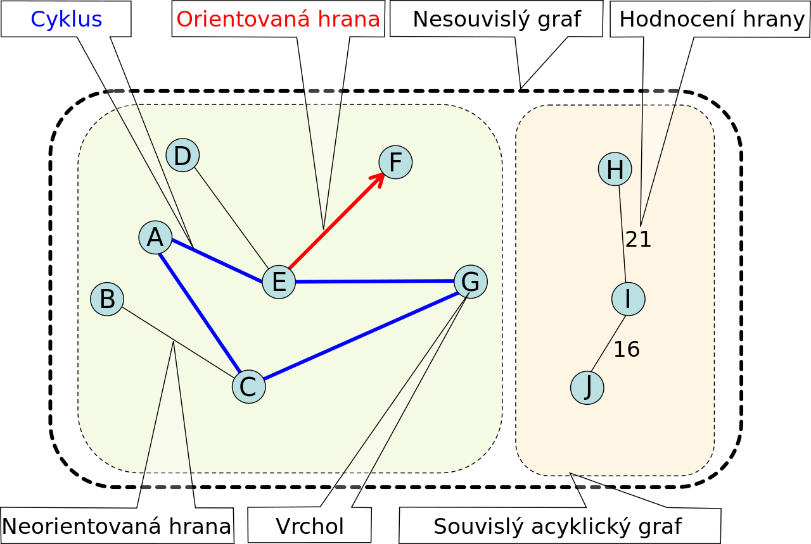
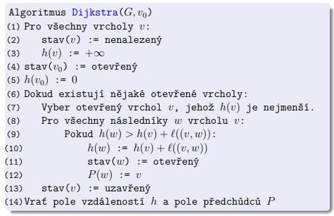
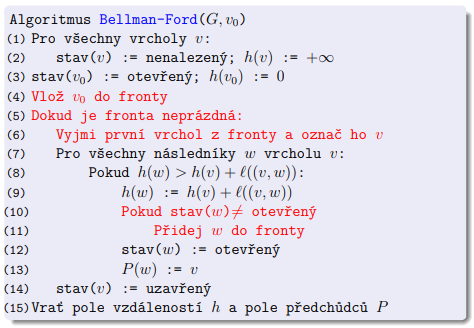

---
author:
- Daniel Hampl
subject: AG1
---

# Základní pojmy

## Graf

**Neorientovaný graf je uspořádaná dvojice ($V, E$)**, kde

-   V je neprázdná konečná množina vrcholů,

-   E je množina hran.

**Množina všech možných hran: $\binom{V}{2}$.** Platí tedy
$E \subseteq \binom{V}{2} \subseteq 2^V$, kde $2^V$ je množina všech
podmnožin množiny V.

**Nechť $G$ je graf.** Pak:

-   $V(G)$ značí jeho množinu vrcholů a $|V(G)|$ velikost této množiny

-   $E(G)$ značí jeho množinu hran a $|E(G)|$ velikost této množiny

Dále, **nechť $e = \{u, v\}$ je hrana grafu G.** Pak:

-   $u$ a $v$ jsou **koncové vrcholy**

-   oba koncové body jsou si na grafu $G$ navzájem **sousedy**

-   oba koncové body jsou **incidentní** s hranou $e$

## Doplněk

**Doplěk** $\overline{G}$ grafu $G = (V, E)$ je graf
$(V, \binom{V}{2} \backslash E)$.

{width="50%"}

## Isomorfismus

Grafy $G$ a $H$ jsou **isomorfní**, právě tehdy, když existuje zobrazení
$f:V(G)~\rightarrow~V(H)$, kde $f$ je bijekce a pro každou dvojici
vrcholů $u$ a $v$ z $V(G)$ platí, $\{u,v\} \in E(G)$ právě tehdy, když
$\{f(u), f(v)\} \in E(H)$.

**Automorfismus** grafu $G$ je isomorfismus, grafu $G$ se sebou samým.
(ukazuje symetrie grafu)

## Vrcholy

**Stupeň** vrcholu $v$ v grafu $G$ je počet hran, které vrchol $v$
obsahují a značíme jej $deg_G(v)$.

**Otevřené okolí** vrcholu $v$ v grafu $G$ je množina všech sousedů
vrcholu $v$ a značíme jej $N_G(v$).

**Uzavřené okolí** vrcholu $v$ v grafu $G$ je $N_G(v) \cup \{v\}$ a
značíme jej $N_G[v]$.

**Regulární graf**, je graf, ve kterém mají všechny vrcholy stejný
stupeň.

**Princip sudosti** $\sum_{v \in V} deg_G(v) = 2|E|$

## Podgraf

Graf $H$ je **podgrafem** grafu $G$, když $V(H) \subseteq V(G)$ a
$E(H) \subseteq E(G)$; tuto skutečnost značíme $H \subseteq G$.

Graf $H$ je **indukovaným podgrafem** grafu $G$, když
$V(H) \subseteq V(G)$ a $E(H) = E(G) \cap \binom{V(H)}{2}$; tuto
skutečnost značíme $H \leq G$.

{width="95%"}

# Typy grafů

## Úplný graf $K_n$

*Graf, kde jsou všechny vrcholy spojeny hranou se všemi ostatními
vrcholy.*

**Nechť $n \geq 1$. Úplný graf na n vrcholech $K_n$ je graf
($V, \binom{V}{2}$), kde $|V| = n$.**

## Úplný $k$-partitní graf

*Graf, rozdělený na $k$ skupin, kde je každý vrchol spojen hranou se
všemi vrcholy ze všech ostatních skupin, ale není spojen s žádným
vrcholem ze své vlastní skupiny.*

**Nechť $\forall i ∈ \{1, . . . k\} : n_i \geq 1$. Úplný $k$-partitní
graf $K_{n1,n2,...,nk}$ je graf ($\cup^k _{i=1} V_i, E),$kde
$\forall i, j ∈ \{1, . . . , k\}, i \neq j : V_i \cap V_j = \emptyset, |V_i| = n_i$
a
$E = \{\{x, y\} | \exists i, j \in \{1, . . . , k\}, i \neq j : x ∈ V_i, y ∈ V_j\}$,
neboli
$E = \binom{ \cup^k_{i=1} V_i}{2} \backslash \cup^k_{i=1} \binom{V_i}{2}$.**

## Cesta $P_m$

*Graf, který má $m$ hran, $m+1$ vrcholů a tvoří cestu.*

**Nechť $m \geq 0$. Cesta délky $m$** (s $m$ hranami) **$P_m$ je graf
($\{0, . . . , m\}, \{\{i, i + 1\} | i \in \{0, . . . ,m-1\}\}$).**

## Kružnice $C_n$

*Graf, který ma $n$ vrcholů i hran a na všechny vrcholy navazují právě
dvě hrany.*

**Nechť $n \geq 3$. Kružnice délky $n$ $C_m$ je graf
($\{1, . . . , n\}, \{\{i, i + 1\} | i \in \{1, . . . ,n-1\}\} \cup \{\{1, n\}\}$).**

## Hvězda $S_n$

*Uplný bipartitní graf, kde je v první partitě právě jeden vrchol a ve
druhé alespoň jeden vrchol.*

**Nechť $n \geq 1$. Hvězda s $n$ paprsky $S_n$ je graf $K_{1,n}$.**

# Procházení grafu

## Vzdálenost

Vzdálenost $d(u, v)$ dvou vrcholů $u$ a $v$ v (orientovaném) grafu $G$
je délka nejkratší (orientované) cesty v $G$ z vrcholu $u$ do vrcholu
$v$. Pokud z $u$ do $v$ žádná cesta neexistuje, definujeme
$d(u, v) = \inf$.

## DFS

*Prohledávání do hloubky*

    Algoritmus DFS_graf (graf G, vrchol v):
    (1) pro každý vrchol u ∈ V (G):
    (2)     stav(u) := nenalezený
    (3) DFS(v)

    DFS (vrchol v):
    (4) Když stav(v) není nenalezený
    (5)     return
    (6) stav(v) := otevřený
    (7) Pro každého souseda u vrcholu v:
    (8)     DFS(u)
    (9) stav(v) := uzavřený

## BFS

*Prohledávání do šířky*

    Algoritmus BFS(G, s):
    (1) pro každý vrchol v ∈ V (G):
    (2)     stav(v) := nenalezený
    (3)     D(v) := P(v) := undef
    (4) stav(s) := otevřený
    (5) D(s) := 0
    (6) Q := fronta obsahující s
    (7) Dokud je fronta Q neprázdná:
    (8)     Odeber začátek fronty Q, označ ho v
    (9)     Pro všechny sousedy w vrcholu v:
    (10)        Pokud stav(w) = nenalezený:
    (11)        stav(w) := otevřený
    (12)        D(w) := D(v) + 1
    (13)        P(w) := v
    (14)        přidej w do fronty Q
    (15)    stav(v) := uzavřený

# Souvislost

## Souvislý graf

Graf $G$ je **souvislý**, pokud pro každé dva vrcholy $u$, $v$ v grafu
$G$ existuje $u$-$v$-cesta.

## Souvislá komponenta

Indukovaný podgraf $H$ grafu $G$ je souvislou komponentou, pokud je
souvislý a neexistuje žádný souvislý podgraf $F$, $F \neq H$, grafu $G$
takový, že $H \subseteq F$. (Souvislá komponenta je tedy v inkluzi
maximální souvislý podgraf grafu $G$).

# Topologické uspořádání grafu

## Definice

Topologické uspořádání orientovaného acyklického grafu $G = (V, E)$ je
takové pořadí vrcholů $v_1, v_2, . . . , v_n$ grafu $G$, že pro každou
hranu $(vi, vj) \in E$ platí $i~<~j$.

## TopSort

{width="80%"}

# Ohodnocený graf

## Minimální kostra

Nechť $G = (V , E)$ je souvislý neorientovaný graf a
$w : E \rightarrow R$ váhová funkce, která přiřazuje hranám čísla --
jejich váhy. Váhovou funkci můžeme přirozeně rozšířit na podgrafy: Váha
$w(H)$ podgrafu $H \subseteq G$ je součet vah jeho hran. Kostra je
minimální, pokud má mezi všemi kostrami nejmenší váhu.

{width="80%"}

{width="80%"}

## Hledaní nejkratšíí cesty

***Dijkstrův**: předpokládá nezáporné ohodnocení hran*

***Bellmanův-Fordův**: předpokládá neexistenci záporných cyklů v grafu*

{width="80%"}

{width="80%"}
