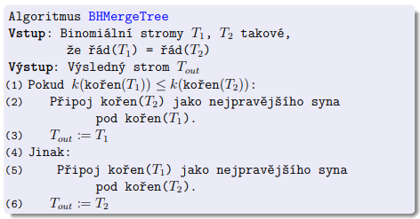
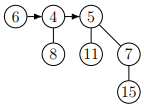

---
author:
- Daniel Hampl
subject: AG1
---

# Binární haldy

{width="40%"}

Binární minimová halda je datová struktura tvaru binárního stromu, v
jehož každém vrcholu $x$ je uložen jeden klíč $k(x)$ a která splňuje
tyto dvě vlastnosti:

-   **Tvar haldy**: Strom má všechny hladiny kromě poslední plně
    obsazené. Poslední hladina je zaplněna od levého okraje směrem k
    pravému.

-   **Haldové uspořádání**: Je-li $v$ vrchol a $s$ jeho syn, plat
    $k(v)\leq k(s)$.

-   Binární halda s $n$ prvky má $\lfloor$log $n \rfloor + 1$ hladin.

-   Binární halda s $n$ prvky má $\lceil n/2\rceil$ listů a
    $\lfloor n/2 \rfloor$ vnitřních vrcholů.

## Vložení prvku do haldy

-   $O($log$~n)$

-   Tvar haldy dovoluje přidat okamžitě nový prvek na konec nejspodnější
    hladiny.

-   Pokud by již byla plná, založíme novou hladinu.

-   Pokud je haldové uspořádání mezi novým listem $l$ a jeho otcem $o$ v
    pořádku, můžeme skončit. Pokud ne, prohodíme $k(l)$ a $k(o)$.

-   Tím ale může nastat problém mezi klíčem vrcholu $o$ a klíčem otce
    vrcholu $o$ $\implies$ prohodíme a opakujeme BubbleUp

## Odstranění minima

-   $O($log$~n)$

-   Odstranění kořene r stromu haldy by porušilo vlastnost Tvar haldy.

-   Prohoď klíče vrcholů $root$ a $last$, odstraň vrchol $last$ a potom
    přesuň klíč z $root$ na správné místo tak, aby opět platilo haldové
    uspořádání. BubbleDown

## Reprezentace pomocí pole

Kořen haldy uložíme do nultého prvku pole ($array[0]$). Poté pro každý
prvek $array[n]$ jsou jeho následníci uloženi v $array[2n+1]$ a
$array[2n+2]$.

# Binominální strom

{width="40%"}

Binomiální strom řádu $k$ (značíme $B_k$) je uspořádaný (záleží na
pořadí synů) zakořeněný strom, pro který platí:

-   $B_0$ je tvořen pouze kořenem.

-   Pro $k \geq 1$ získáme $B_k$ ze stromů $B_0, B_1, . . . , B_k-1$
    tak, že přidáme nový kořen a kořeny těchto stromů uděláme (takto
    popořadě) syny nového kořene.

{width="80%"}

# Binominální halda

{width="40%"}

Binomiální halda obsahující $n$ prvků se skládá ze souboru binomiálních
stromů $T = T_1, . . . , T_i$, kde

-   Uchovávané prvky jsou uloženy ve vrcholech stromů $T_i$. Prvek
    uložený ve vrcholu $v \in V(T_i)$ značíme $k(v)$.

-   Pro každý strom $T_i$ platí tzv. haldové uspořádání, neboli pro
    každý $v \in V(T_i)$ a jeho syny $s_1, . . . , s_k$ platí
    $k(v) \leq k(s_j)$, $j = 1, . . . , k$.

-   V souboru $T$ se žádný řád binomiálního stromu nevyskytuje více než
    jednou.

-   Soubor stromů $T$ je uspořádán vzestupně podle jejich řádů (tedy
    podle stupňů jejich kořenů a tedy podle velikosti).

Binomiální strom $B_k$ se vyskytuje v souboru stromů $n$-prvkové
binomiální haldy právě tehdy, když je v dvojkovém zápisu čísla $n$
nastavený $k$-tý nejnižší bit na 1.

$n$-prvková binomiální halda sestává z $O($log $n)$ binomiálních stromů.

**Složitost**

-   Vložení $O($log $n)$

-   Nalezení minima při udržení pointeru na minimum: $O(1)$, jinak
    $O($log $n)$

-   Extrakce minima $O($log $n)$

-   Merge $O($log $n)$

-   Build $O(n)$

-   Delete $O($log $n)$

**Merge** hald probíhá stejně, jako sčítání dvou binárních čísel.

# Vyhledávací stromy

## BVS

{width="40%"}

Binární vyhledávací strom (BVS) je binární strom, v jehož každém vrcholu
$v$ je uložen unikátní klíč $k(v)$. Přitom pro každý vrchol $v$ musí
platit:

-   Pokud $a \in L(v)$, pak $k(a) < k(v)$ .

-   Pokud $b \in R(v)$, pak $k(b) > k(v)$.

Binární vyhledávací strom nazveme dokonale vyvážený, pokud pro každý
jeho vrchol v platí $|L(v)|~-~|R(v)|~\leq~1$.

**Složitost** základních operací na BVS je průměrně $O($log $n)$, ale
může dosáhnout až $O(n)$.

## AVL

Binární vyhledávací strom nazveme AVL stromem, pokud pro každý jeho
vrchol v platí $h(l(v))~-~h(r(v)) \leq 1$.

Budeme v každém vrcholu $v$ udržovat číslo $δ(v) = h(r(v)) - h(l(v))$,
které nazveme znaménko vrcholu $v$.

V korektním AVL stromu může nabývat jen těchto hodnot:

-   δ(v) = +1 (pravý podstrom hlubší) -- takový vrchol značíme $+$,

-   δ(v) = -1 (levý podstrom hlubší) -- značíme $-$,

-   δ(v) = 0 (oba podstromy stejně hluboké) -- značíme $\cdot$.

**Složitost** základních operací na AVL je $O($log $n)$.

{width="\\textwidth"}

{width="\\textwidth"}

# Hešovací tabulky

## Hešování s řetízky

Prvky jsou ukládány do pole či spojového seznamu odpovídající
příslušnému heši.

{width="50%"}

## Otevřená adresace

Prvky jsou ukládány na další následující místo v poli získané za pomoci
dvojité hešovací funkce. V případě mazání prvku se zamění za značku
smazaného prvku, který značí možnou existenci dalších prvků s
ekvivalentním hešem. Následně, pokud narazíme na značku smazaného prvku
při vkládání, tak se prvek vloží na místo značky. V případě, že na tuto
značku narazíme při vyhledávání, tak pokračujeme na další iteraci
algoritmu, protože jestli při uložení byla tato pozice již zaplněná,
může hledaný prvek být jinde.

**Dvojité hešování**:Prohledávací posloupnost je dána funkcí
$h(k, i) = (f(k) + i \cdot g(k)) \text{mod } m$, kde
$f : U \rightarrow \{0, . . . , m - 1\}$ a
$g : U → \{1, . . . , m - 1\}$ jsou dvě různé hešovací funkce, $m$ je
prvočíslo a $i$ je počet neúspěšných pokusů v aktuální operaci Protože
je $m$ prvočíslo, je s ním $g(k)$ vždy nesoudělné a posloupnost navštíví
každou přihrádku právě jednou. $m$ odpovídá velikosti pole, které se
používá pro ukládání.

{width="80%"}
