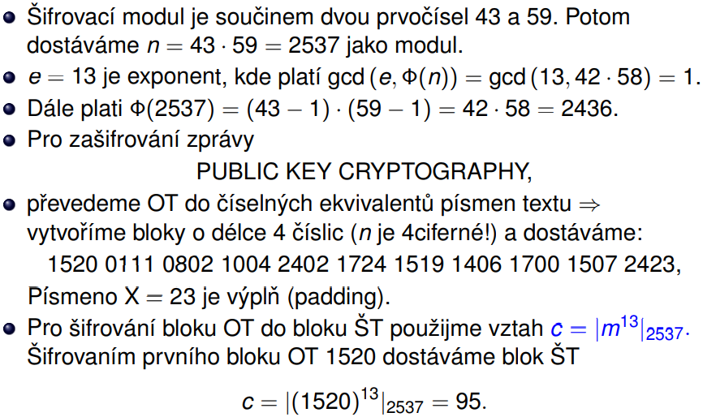
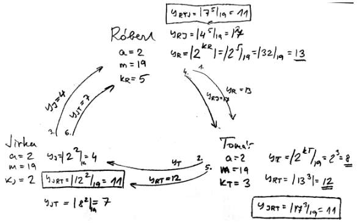
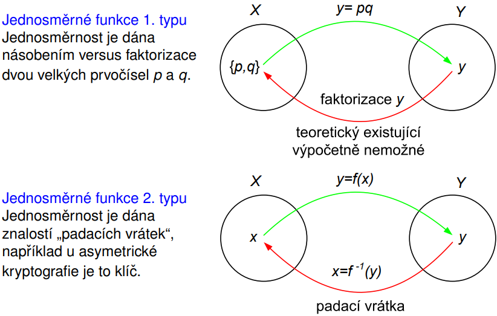
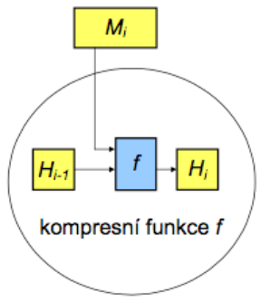

---
author:
- Jakub Rathouský
subject: BEZ
---

# Asymetrické kryptosytémy

-   pro šifrování a dešifrování se používá rozdílného klíče

-   používají se soukromé klíče (SK) a veřejné klíče (VK)

-   šifruje se pomocí VK a dešifruje pomocí SK

-   SK se nedá z VK v rozumném čase zjistit

# RSA

-   zabezpečení utajené komunikace

-   každá dvojice používá šifrovací klíč

    -   pokud je klíč známý =\> dešifrovací klíč vygenerovatelný pomocí
        malého počtu operací

-   šifrovací systém VK je řešením problému s přidělováním klíče

    -   skládá se z veřejného klíče (VK) a tajného klíče (SK)

    -   vypočítat dešifrovací transformaci ze šifrovací je problému

    -   pomocí VK zřízena komunikace s několika subjekty

    -   každý subjekt má VK a SK pro daný šifrovací systém

    -   subjekt si ponechá určité utajené soukromé informace vnesené do
        konstrukce šifrovací transformace pomocí SK

-   seznam klíčů $VK_1, VK_2,\dots,VK_n$ je veřejný

-   subjekt 1 vyšle zprávu $m$ subjektu 2:

    -   zpráva = blok (obvykle 1) určité délky; bloku OT $m$ odpovídá
        blok ŠT, písmena -\> numerické ekvivalenty

    -   subjekt 2 s použitím dešifrovací transformace dešifruje blok ŠT

-   dešifrovací transformaci nelze najít v rozumném čase bez znalosti
    klíče

Definice:

-   $p$ a $q$ jsou prvočísla

-   $n = p*q$, $\Phi(n) = (p - 1)(q - 1)$

-   zvolí se $e$, $1 < e < n$, gdc($e$, $\Phi(n)$) = 1 a spočte se
    $d = |e^{-1}|_{\Phi(n)}$

-   VK = (n, e) - ten se zveřejní

-   SK = (d, e) - soukromý

## Princip systému

-   šifrovací systém VK a je založený na modulárním umocňování

-   dvojice ($e$, $n$) je VK; $e$ - exponent, $n$ - modul

-   n = součin dvou privočísel $p$ a $q$, tj. $n = p*q$ a
    gcd($e$,$\Phi(n)$) = 1

-   zašifrování OT: písmena = numerické ekvivalenty, vytváří se bloky s
    největší možnou velikostí (se sudým počtem číslic)

-   pro zašifrování zprávy $m$ na ŠT $c$ se použije vztah:

    -   $E(m) = c = |m^e|_n, 0 < c < n$

-   pro dešifrování se použije inverze $d$ čísla $e$ modulo $\Phi(n)$
    (existuje protože gcd($e$, $\Phi(n)$) = 1))

-   pro dešifrování bloku $c$ platí:

    -   D($c$) =
        $|c^d|_n = |m^{ed}|_n = |m^{k*\Phi(n)+1}|_n = |(m^{\Phi(n)})^k*m|_n = |m|_n$

    -   kde $e*d = k*\Phi(n) + 1$ pro nějaké celé číslo
        $k (|ed|_{\Phi(n)} = 1)$ a z Eulerovy věty platí
        $|p^{\Phi(n)}|_n = 1$, kde gcd($p$, $n$) = 1

-   dvojice (d, n) je dešifrovací klíč - tajná část klíče

{width="80%"}

{width="80%"}

## Bezpečnost

-   modulární umocnění potřebné k šifrování zprávy s použitím RSA může
    být provedeno při VK a $m$ o velikosti $~200$ dekadických číslic za
    několik sekund

-   se znalostí $p$ a $q$ a s použítím Euklidova algoritmu lze najít
    dešifrovací klíč $d$

-   bez znalosti prvočísel $p$ a $q$ není lehké nalézt dešifrovací klíč,
    najít je pomocí $\Phi(n)$ je podobně složité jako faktorizace celého
    čísla $n$

### Problém faktorizace

-   jedná se o převedení čísla na součin jeho faktorů (rozklad na
    prvočísla)

-   pokud $p$ a $q$ jsou 100číslicová prvočísla, tak pak $n$ je
    200číslicové

-   nejrychlejší známý algoritmus potřebuje pro faktorizaci $~10^6$ roků
    k faktorizci takového čísla

-   naopak, pokud je známo d, ale nezná se $\Phi(n)$, je možné lehce
    faktorizovat n, protože se ví, že $e*d - 1$ je násobkem $\Phi(n)$

-   čím větší modulo, tím je výpočet náročnější

-   ochrana proti speciálním rychlým technikám:

    -   obě hodnoty $p-1$ a $q-1$ by měly mít velký prvočíselný faktor

    -   gcd($p-1$, $q-1$) by mělo být malé a $p$ a $q$ by měly mít
        rozdílnou desítkovou reprezentaci v délce několika málo číslic

# RSA digitální podpis

-   RSA lze použít pro vyslání podepsané zprávy

-   při použití podpisu se příjemce může ujistit, že:

    -   zpráva přišla od oprávněného odesílatele

    -   a je tomu tak na základě nestranného a objektivního testu

-   takové ověření je potřeba pro elektronickou počtu, elektronické
    bankovnictví, elektronický obchod...

## Princip

-   subject 1 vysílá podepsanou zprávu $m$

-   subjekt 1 spočítá pro zprávu $m$ OT

    -   $S = D_{SK_1}(m) = |m^{d_1}|_{n_1}$

    -   kde $SK_1$ = ($d_1, n_1$) je tajný klíč pro subjekt 1

-   když $n_2 > n_1$, kde $VK_1$ = ($e_2$,$n_2$) je veřejný šifrovací
    klíč pro subjekt 2, subjekt 1 zašifruje S pomocí vztahu

    -   $c = E_{VK_2}(S) = |S^{e_2}|_{n_2}$

    -   $0 < c < n_2$

-   když $n_2 < n$ subjekt 1 rozdělí S do bloků o velikosti menší než
    $n_2$ a zašifruje každý blok s použitím šifrovací transformace
    $E_{VK_2}$

-   pro dešifrování subjekt 2 nejdříve použije soukromou dešifrovací
    transformaci $D_{SK_2}$ k získání S, protože

    -   $D_{SK_2}(c) = D_{SK_2}(E_{VK_2}(S)) = S$

-   k nalezení OT $m$ subjekt dále použije veřejnou šifrovací
    transoformaci $E_{VK_1}$, protože

    -   $E_{VK_1}(S) = E_{VK_1}(D_{SK_1}(m)) = m$

-   kombinace OT $m$ a podepsané verze S přesvědčí subjekt 2, že zpráva
    byla vyslána subjektem 1

-   také subjekt 1 nemůže odepřít, že on vyslal danou zprávu, žádný jiný
    subjekt než 1 nemůže generovat podepsanou zprávu S z originálního
    textu zprávy $m$

{width="80%"}

# Diffie-Hellman

Vhodná šifra pro zřízení společného kníče pro dva a více subjektů. První
účastník zvolí modulo $m$ a číslo $a$. Každý objekt si zvolí svůj
privátní klíč $k$. Musí platit:

-   gcd(m, a) = 1

-   gcd($k_i$, m-1) = 1

## Princip

-   volba veřejných prvků účastníkem A: $m$ prvočíslo a $a$ celé číslo
    $\rightarrow 0 < a < m$

-   generování parametrů klíče účastníkem A: volba čísla $k_1 < m$ a
    výpočet $y_1 = |a^{k_1}|_m$

-   účastník A odešle účastníkovi V čísla $a, m$ a $y_1$

-   generování parametrů klíče účastníkem B: volba čísla $k_2 < m$ a
    výpočet $y_2 = |a^{k_2}|_m$

-   účastník B odešle účasníkovi A číslo $y_2$

-   generování společného klíče Ačkem: $K = |Y^{k_1}_2|_m$

-   generování společného klíče Bčkem: $K = |Y^{k_2}_1|_m$

-   veřejnými prvky jsou čísla $m$ a $a$

-   neautorizovaný subjekt nemůže najít společný klíč $K$ v rozumném
    čase, protože je nucen hledat logaritmus modulo $m$

{width="80%"}

## Bezpečnost

-   délka klíče je přímo uměrná kvalitě šifry

-   když je $m$ prvočíslo a $m-1$ je součin malých prvočísel
    $\rightarrow$ je možné pomocí speciální metody nalézt logaritmus
    modulo $m$ méně operacemi než $O(log^2_2m)$

## Problém diskrétního logaritmu

-   $C = t^k (mod p)$

-   pokud se zná t, k a p $\Rightarrow$ C se spočítá snadno

-   inverzní operace je ale náročná - tzn. spočítat k ke znalosti t, p a
    C

-   $k = |log_t(C)|_p$, k = diskrétní logaritmus

# Hešovací funkce

Silný nástroj moderní kryptografie. Jedna z klíčových kryptologických
myšlenek. Základní pojmy: *jednosměrnost* a *bezkoliznost*.

-   původní význam hešovací funkce byla funkce, která libovolně velkému
    vstupu přiřadila krátký hash kód o pevně definované délce

-   v součastnosti se pojem hash funkce používá v kryptografii pro
    krypto-hash funkce, která má oproti původní definici ještě navíc
    vlastnosti *jednosměrnost* a *bezkoliznost*

Vezme se přirozené číslo $d$ a množina $X$ všech binárnách řetězců délky
0 až $d$. Funkce $f: X -> \{0, 1\}^n$ se nazve hešovací, pokud je
jednosměrná `1. typu` a `bezkolizní`. Každému binárnímu řetězci z
množiny X přiřadí binární hash-kód délky $n$ bitů.

## Vstup a výstup

-   hash funkce h zpracovává prakticky neomezeně dlouhá vstupní data M
    na krátký výstupní hash kód h(M) pevné a předem stanovené délky

Z hlediska bezpečnosti se požaduje, aby se hešovací funkce chovala jako
náhodné orákulum:

-   orákulum = libovolný nástroj, který na základě vstupu odpoví nějakým
    výstupem. Na ten samý vstup, musí odpovědět stejně

-   náhodné orákulum - orákulum, které na nový vstup odpoví náhodným
    výběrem výstupu z množiny výstupů

## Jednosměrnost

Funkce $f: X \rightarrow Y$, pro něž je snadné z jakékoli hodnoty
$x \in X$ vypočítat $y = f(x)$, ale pro nějaký náhodně vybraný obraz
$y \in f(X)$ nelze najít její vzor $x \in X$ tak, aby $y = f(x).$
Jednosměrné funkce se dělí na:

-   jednosměrné, pro které je výpočetně nemožné, ale teoretický
    existující, najít vzor z obrazu

-   jednosměrné funkce s padacími vrátky, u kterých lze najít vzor z
    obrazu, ale jen za předpokladu znalosti \"padacích vrátek\" - klíče

{width="60%"}

## Bezkoliznost

### Bezkoliznost 1. řádu

Je odolnost proti kolizi a požaduje, aby bylo výpočetně nezvládnutelné
nalezení libovolných dvou různých zpráv tak, že budou mít stejnou hash.
Pokud k tomu dojde, tak se nalezla kolize. (lidsky: pro dvě lib. se
nesmí zjistit, že se zahashují stejně)

-   bezkoliznost se zásadně využívá k digitálním podpisům

-   nepodepisuje se přímo zpráva, ale pouze její hash

-   bezkoliznost zaručuje, že není možné nalézt dva dokumenty se stejnou
    hash

### Bezkoliznost 2. řádu

Hashovací funkce $h$ je odolná proti nalezení 2. vzoru, jestliže pro
daný náhodný vzor x je výpočetně nezvládnutelné nalézt 2. jiný vzor tak,
že se zahashují stejně. (lidsky: máme vzor a nesmíme k tomu najít druhý,
aby se zahashovaly stejně)

## Konstrukce moderních hash funkcí

Moderní hash funkcí, může být velmi dlouhá. Zpráva se proto zpracovává
po částech. Nutnost hashování po blocích a zarovnávat vstupní zprávy na
celistvý počet bloků. Zarovnání musí být bezkolizní a umožňovat
jednoznačné odejmutí.

### Zarovnání

Zarovnání musí být jednoznačné, aby nevznikly jednoduché kolize.
Doplněním například 0 bitem by způsobilo zmatek, který poslední nultý
bit je platný. U nových hash funkcí se doplní bit 1 a pak zbytek 0. Tím
se rozezná, kde je konec zprávy.

### Damgard-Merklovo zesílení

Jedná se o doplnění o délku původní zprávy. Zpráva je doplněna bitem 1 a
pak bity 0 tak, aby na konci zbylo 64 bitů volných. Do nich je vyplněna
hodnota bitů původní zprávy. Začlenění informace o délce původní zprávy
eliminuje případné útoky. Současné hash funkce používají DM princip
iterativně s využitím kompresní funkce.

Kompresní metoda zpracuje aktuální blok zprávy a výsledek je určitá
hodnota, která nutně tvoří vstup do další iterace. Ta funkce má dva
vstupy, předchozí krok a další blok. Prvotní zavolání obsahuje první
blok a definovanou konstantu, která se říká *inicializační hodnota*.

## SHA-2

Pod SHA-2 patří SHA-(224/256/384/512).

Založen na Damgard-Merklově konstrukci:

-   je to iterativní konstrukce

-   f zpracovává aktuální blok zprávy $M_i$ a výsledek je kontext $H_i$

-   $H_i$ nutně tvoří vstup do f v dalším kroku

-   f má tedy vstupy $H_{i-1}$ a $M_i$

{width="60%"}

SHA = Secure Hash Algorithm

-   nástupce SHA-1

-   nejvýznamější rozdíly jsou v délce hashovacího kódu, který určuje
    odolnost hashového kodu vůči nalezení kolizí 1. a 2. řádu

{width="60%"}

## HMAC

Klíčované hashované autentizační kódy zpráv HMAC zpracovávají hashováním
nejen zprávu M, ale spolu s ní i nějaký tajný klíč K. Jsou proto podobné
autentizačnímu kódu zprávy MAC, ale místo blokové šifry se použije
hashovací.

Používají se k nepadělatelnému zabezpečení zpráv a autentizaci
(prokázáním znalosti tajného klíče). HMAC je obecná konstrukce, která
využívá obecnou hashovací funkci. Podle konkrétní hashovací funkce,
která se konkrétně používá, se označuje výsledná funkce (HMAC-SHA-1(M,
K) používá sha-1, kde M je zpráva a K je tajný klíč).

### Algoritmus

Definuje se konstantní řetězen *ipad* jako řetězec b/8 bajtů s hodnotou
0x36 a *opad* jako řetězec b/8 bajtů s hodnotou 0x5C. Klíč $K$ se doplní
bity 0 vlevo od MSB bitu klíče do délky b-bitu a označí se $K^+$.
Definuje se hodnota $HMAC_k(M)$ jako:

$HMAC_k(M) = H((K^+ \oplus opad)||H((K^+ \oplus ipad)||M))$

### Nepadělatelnost

Pokud je kod připojen za zprávu M, detekuje neúmyslnou chybu při jejím
přenosu. Zabraňuje útočníkovi změnit zprávu a současně změnit HMAC,
protože bez znalosti klíče nelze nový HMAC vypočítat. Správný HMAC je
autentizací původu dat, odesílatel musel znát tajný klíč.

### Průkaz znalosti

HMAC může být použit jako průkaz znalosti tajného sdíleného klíče při
autentizaci entit. Dotazovatel odešlne náhodou výzvu, které se říká
*challenge* a od provozovatele dostane odpověď *response*. Prokazovatel
zná tajný klíč. Útočník z hodnoty response klíč nemůže odvodit.
