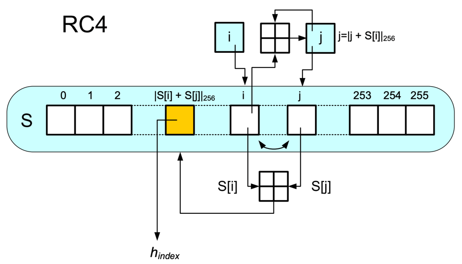

# Symetrické šifry

K šifrování i dešifrování se používá stejný (nebo jednoduše
převoditelný) klíč.

## Proudové

-   Zpracováváno po jednotlivých znacích abecedy.

-   Každý znak šifrován jinou transformací.

-   Obvykle pracují nad binární abecedou $A=\{0,1\}$

-   Vygeneruje se posloupnost $h_1,h_2,\dots,h_n$ (keystream) z klíče K.

-   Proud hesla je postupně slučován s jednotlivými bity proudu OT
    $\Rightarrow$ ŠT.

-   Zobrazení $E, D$ jsou typicky operace XOR.

Pokud proud hesla nezávisí na OT ani ŠT $\Rightarrow$ synchronní
proudové šifry $\Rightarrow$ příjemce a odesílatel přesně
synchronizován.

### RC4

-   Šifra RC4 generuje pseudonáhodný proud bajtů (keystream).

-   Jedna z nejpoužívanejších šifer na internetu.

-   Nevyužívá IV (inicializační vektor) $\Rightarrow$ na každé spojení
    generuje náhodně nový tajný klíč.

-   Šifrovací klíč se používá k vygenerování tajné permutace S.

-   Keystream je pak generován za pomocí permutace S.

Šifra používá tajný vnitřní stav, který se skládá z:

-   permutace S 256 bytů

-   dvou pointerů j, i

```{=html}
<!-- -->
```
    Pseudokód RC4:
    # inicializace permutace S
    j = 0
    S = range(256)
    for i in range(256):
      j = (j + S[i] + k[i % n]) % 256
      swap(S[i], S[j])

    # tvorba hesla
    i = 0
    j = 0
    for index in range(0, n):
      i = (i + 1) % 256
      j = (j + S[i]) % 256
      swap(S[i], S[j])
      h[index] = S[(S[i] + S[j]) % 256]

{width="50%"}

## Blokové

-   Bloková šifra je šifrovací systém $(M,C,K,E,D)$, kde $E$ a $D$ jsou
    zobrazení, definující pro každé $k\in K$ transformaci zašifrování
    $E_k$ a dešifrování $D_k$ tak, že:

    -   zašifrování bloků OT $M=\{m_1,m_2,\dots m_n\}$ probíhá podle
        vztahu $c_i=E_k(m_i)$ pro každé $i\in N$

    -   dešifrování probíhá podle vztahu $m_i = D_k (c_i)$ pro každé
        $i\in N$.

-   Všechny bloky šifrovány stejnou transformací.

-   Zpracováváno po blocích o $t$ znacích abecedy.

-   Blokové šifry využívají principy algoritmů Feistelova typu (použití
    více zakodování pro posílení šifry).

-   Nejznámější blokové šifry používaly a používají blok o délce 64b:
    DES, 3DES, ...

-   V současné době se přechází na blok 128 bitů, který používá standard
    AES.

### DES

-   Používá 16 rund (iterací) a 64b bloky OT a ŠT.

-   Šifrovací klíč $k$ má délku 56b (protože každý 8 bit je paritní).

-   Po počáteční permutaci je blok rozdělen na dvě 32b poloviny
    $(L_0,R_0)$. Každá ze 16 rund transformuje $(L_i, R_i)$ na novou
    hodnotu $(L_{i+1},R_{i+1}) = (R_i, L_i \oplus f(R_i,k_{i+1}))$, liší
    se jen použitím jiného rundovního klíče $k_i$.

-   Ve funkci probíhají operace expanze, permutace a substituce.

{width="30%"}

### 3DES

-   3DES prodlužuje originální DES tím, že používá DES jako stavební
    prvek celkem 3 krát.

-   Používá dva (112b) nebo tři (168b) různé klíče.

-   Kompatibilní s DES ($k_1=k_2=k_3$).

-   Varianta EDE - Encrypt($k_1$), Decrypt($k_2$), Encrypt($k_3$) --
    decrypt je akorát v opačném pořadí a prohodí se E za D (DED).

### AES

-   Náhrada za DES

-   Délka bloku 128 bitů

-   Tři délky klíče: 128, 192 a 256 bitů

-   Není Feistelova typu

-   SubBytes, ShiftRows, MixColumns, AddRoundKey ...

# Operační módy blokových šifer

Operační módy blokových šifer jsou způsoby použití blokových šifer v
daném kryptosystému, kde OT není jen 1 blok blokové šifry, ale obecně
posloupnost znaků dané abecedy.

{width=".75\\linewidth"}

-   Každý blok šifrován zvlášť.

-   Stejné bloky mají stejný šifrovaný obraz.

-   Není nijak zaručena integrita, útočník může libovolně měnit bloky.

{width=".75\\linewidth"}

-   Nejpoužívanější mód blokových šifer.

-   Samosynchronizace po 2 blocích.

{width=".75\\linewidth"}

-   Převádí blokovou šifru na proudovou.

-   Samosynchronizace po 2 blocích.

-   Je třeba jenom jedno zobrazení a to šifrovací (to se použije i při
    dešifrování, jednoduší hw implementace).

{width=".75\\linewidth"}

-   Převádí blokovou šifru na prodovou.

-   Synchonní šifra, heslo je generováno zcela nezávisle na OT a ŠT.

-   Stejně jak CFB stačí pouze šifrování, dešifrování není třeba.

{width=".5\\linewidth"}

-   převádí blokovou šifru na asynchronní proudovou šifru.

-   smyslem je zaručit maximální periodu hesla (pomocí čítače).

-   výhoda: heslo může být vypočítání jen na základě pozice otevřeného
    textu a IV, nezávisle na ostaním.

{width=".75\\linewidth"}

-   Řeší neporušitelnost dat.

-   Podobný jako CBC, ale šifrovaný text se nikam neposílá.

-   Použije se jiný utajený klíč.

-   Nezaručuje nepopíratelnost.
