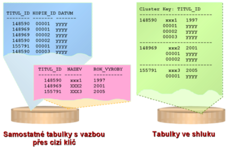
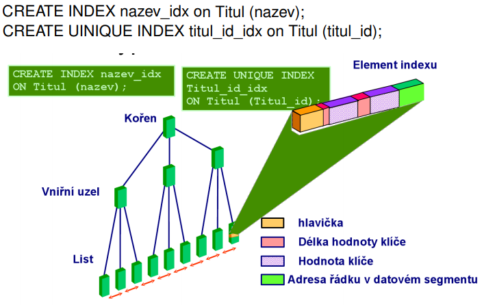

# 3 úrovně pohledu na data

{width="\\textwidth"}

Konceptuální

:   Modelování reality (Obvykle se zachycuje se UML diagramem nebo ER
    modelem). Snaží se nebýt ovlivněna prostředky řešení.

Implementační

:   Konkrétní databázový model, konstrukční dotazovací a manipulační
    prostředky (relační, objektová, síťová, hierarchická, XML, ...)

Fyzická

:   Sekvenční soubory, indexy, clustery apod.

# Konceptuální modelování databází

-   společné chápání objektu aplikace uživateli a projektanty

-   integrace několika uživatelských pohledů

-   výsledek je vstupem do realizace DB

-   slouží jako dokumentace

# Implementační

-   nejnižší míra abstrakce

-   v této fázi probíhá realizace datové struktury, popsané v
    konceptuálním modelu

-   model je zde transformován do modelu odpovídající konkrétní
    technologii

-   musí zohledňovat všechny dostupné prostředky a možnosti

-   popisuje, čím je datový obsah systému, popsaný konceptuálním a
    strukturálním modelem, realizován

# Fyzický pohled

## Struktury pro ukládání dat v relačních DB s ohledem na rychlý přístup k nim (speciální způsoby uložení, indexy apod.)

### Heap

-   nové záznamy přidány do libovolného prázdného místa

-   žádné uspořádání

-   hledání je O(n)

### Heap s indexy

-   záznamy jsou uspořádány

-   víme, když už můžeme ukončit hledání

### Cluster index

-   index pages

-   struktura už obsahuje samotné záznamy

-   můžeme mít jenom jeden clustered index nad stejnými daty

### Noncluster index

-   ukazatele do samotných záznamů

-   libovolná organizace indexu (ROW ID)

### Bitmapové indexy

-   binární matice

-   předem vypočítané odpovědi na jednoduché otázky (true/false), a to
    pro každý záznam

-   DLM operace velmi drahé

-   spíš pro DSS (ne OLTP)

-   vhodné pro záznamy s velmi neunikátními položkami

DSS = decission support system - velká rozhodnutí, založena na
historických datech OLTP = online transaction processing - aktuální
data, každodenní transakce

### Shluk

Tabulky dané do jednoho shluku.

{width="\\textwidth"}

### Index typu B\*-Tree

{width="\\textwidth"}

-   kořen má nejméně 2 potomky, pokud není listem

-   každý uzel kromě kožene a listu má nejméně \[m/2\] a nejvýše m
    potomků

-   každý uzel má nejméně \[m/2\] - 1 a nejvíce m - 1 datových záznamů

-   všechny cesty ve stromě jsou stejně dlouhé

-   data v nelistovém uzlu jsou organizována

-   listy obsahují úplnou množinu klíču a mohou se lišit strukturou

# Důležité poznatky

-   (relační) databáze bez indexu nefungují rozumně - indexy jsou nutné
    (pro větší data)

-   DB stroj často některé indexy vytváří automaticky kvůli kontrole IO
    (integritní omezení)

-   v OLTP se nejčastěji používají indexy na bázi B-stromů (tam kde jsou
    data unikátní)

-   kde jsou data velmi neunikátní a potřebují se indexovat, tam se
    používají bitmapové indexy

-   indexy je třeba udržovat (zjednodušeně - ušetřím na dotazech, platím
    více při DML)

-   klič indexu (indexované atributy) může být složený

-   index může být unikátní/neunikátní
