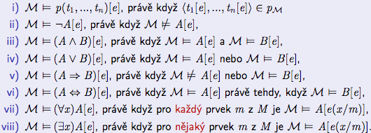

# Jazyk predikátové logiky

Jazyk obsahuje *logické symboly* a *mimologické symboly L*.

-   symboly pro *proměnné* (x, y, z)

-   symboly pro *logické spojky*
    ($\neg, \wedge, \vee, \Rightarrow, \Leftarrow$)

-   symboly pro *kvantifikátory* vždy následuje proměnná

    -   obecný - \"všichni\" $\forall$

    -   existenční - \"některé/existuje\" $\exists$

-   pomocné symboly - závorky

-   symboly pro *konstanty* (K, S, ...)

-   symboly pro *predikáty* ($p, q, r$) - dána četnost

-   symboly pro *funkce* ($f, g, \dots$)

## Term

Řetězec symbolů se nazývá `term` jestliže vznikne použitím těchto
pravidel v konečně mnoho krocích:

-   každá proměnná a konstanta je term

-   jsou-li $t_1, t_2,\dots,t_n$ termy a $f$ je $n$-ární funkční symbol,
    potom $f(t_1,\dots,t_n)$ je term

## Formule

`Formule` je posloupnost symbolů, která vznikne aplikací následujících
pravidel v konečné mnoha krocích:

-   je-li $n$-ární predikátový symbol a $t_1,...,t_n$ jsou termy, pak
    $p(t_1,...,t_n)$ je formule - atomická formule

-   jsou-li A a B formule, pak $\neg A, (A \wedge B), (A \vee B)\dots$
    jsou formule

-   je-li $x$ proměnná a A formule, pak $(\forall{x})$A a
    $(\exists{x})$A jsou formule

## Volné a vázané proměnné

-   podformule B je část formule A, která je sama formulí

-   proměnná x má vázaný výskyt v A právě, když se vyskytuje v její
    podformuli ve tvaru $(\forall{x})B(x)$ nebo $(\exists{x})B(x)$

-   výskyt proměnné v A, který není vázaný, je volný výskyt

```{=html}
<!-- -->
```
-   uzavřená formule obsahuje pouze vázané proměnné

-   otevřená formule obsahuje pouze volné proměnné

# Interpretace jazyka

Interpretace (realizace, struktura) $\mathcal{M}$ =
$<M,\dots,K_\mathcal{M},\dots,p_\mathcal{M},\dots,f_\mathcal{M},\dots>$
jazyka L obsahuje:

-   neprázdnou množinu M, kterou nazýváme universum interpretace,

-   je-li K konstanta, pak její interpretaci $K_\mathcal{M} \in M$

-   je-li p $n$-ární predikát, pak $n$-ární relaci
    $p_\mathcal{M} \subseteq M^n \rightarrow M$ jako jeho interpretaci

-   je-li f funkce mající n argumentů, pak funkci
    $f_\mathcal{M}: M^n \rightarrow M$ jako její interpretaci

Jeden jazyk může mít více interpretací

# Pravdivost formulí

L je jazyk a M je jeho interpretace

-   ohodnocení proměnných je funkce $e$ z množiny proměnných, které
    každé volné proměnné přiřazuje nějaký prvek univerza M

-   výrazem $t[e]$ označujeme hodnotu termu $t$ při ohodnocení $e$.

    -   je-li term $t$ proměnná $x$, pak $t[e]$ = $e(x)$

    -   je-li n-ární funkční symbol a term $t$ je $f(t_1,...,t_n)$, pak
        $t[e] = f(t_1[e],...,t_n[e])$

-   výraz e(x/m) se označuje hodnocení, které všem proměnným přiřadí
    stejnou hodnotu jako e, jenom e(x) = m

Pravdivost formule v interpretaci $\mathcal{M}$ při ohodnocení e se
definuje indukcí podle složitosti formule

{width="\\textwidth"}

Formule A je pravdivá (platná) v interpretaci $\mathcal{M}$, právě když
pro každé ohodnocení e je pravdivá, tj. $\mathcal{M} \models A[e]$.
Formule A je splnitelná, právě když v nějaké interpretaci $\mathcal{M}$
pro nějaké ohodnocení e je pravdivá. A je kontradikce, právě když není
splnitelná.

# Logická ekvivalence, logický důsledek

-   A a B jsou logicky ekvivaletní, $A \models B \wedge B \models A$,
    právě když pro každou interpretaci $\mathcal{M}$ a pro každé
    ohodnocení e platí: $\mathcal{M} \models A[e]$, právě když
    $\mathcal{M} \models B[e]$

-   B je logickým důsledkem A, $A \models B$, právě když pro každou
    interpretaci $\mathcal{M}$ a pro každé ohodnocení e platí: jestliže
    $\mathcal{M} \models A[e]$, pak $\mathcal{M} \models B[e]$

# Příklad matematického příkladu

-   $(\exists{u})(x = u + u)$ - x je sudé = negace =
    $(\forall{u})\neg(x = u + u)$

-   $\neg(\exists{u})(x = u + u)$ - x je liché

-   $(\exists{x})(x = y*z)$ - x dělí y

# Teorie a Model

-   teorie je množina uzavřených formulí

-   interpretace $\mathcal{M}$ jazyka L je modelem T, jestliže každá
    formule platí v $\mathcal{M}$

-   formule A je logický důsledek teroie T, jestliže v každém modelu
    teorie T platí A

-   teorie T je splnitelná, právě když má model

Teorie ekvivalence:

-   L = r(x,y). Predikát r(x, y) je ekvivalence, jestliže platí

    -   R: $(\forall{x}) r(x,x)$ - reflexifita

    -   T:
        $(\forall{x})(\forall{y})(\forall{z})(r(x,y) \wedge r(x,y) \Rightarrow r(x,z))$ -
        tranzitivita

    -   S $(\forall{x})(\forall{y})(r(x,y) \Rightarrow r(y,x))$ -
        symetrie

Teorie neostrého uspořádání

-   L = q(x, y). Pro teorii neostrého uspořádání platí následující
    axiomy

    -   R: $(\forall{x}) r(x,x)$ - reflexifita

    -   T:
        $(\forall{x})(\forall{y})(\forall{z})(r(x,y) \wedge r(y,z) \Rightarrow r(x,z))$ -
        tranzitivita

    -   As
        $(\forall{x})(\forall{y})(r(x,y) \wedge r(y,x) \Rightarrow (x = y))$ -
        slabá asymetrie

Teorie ostrého uspořádání

-   pro teorii ostrého uspořádání platí následující axiomy

    -   T:
        $(\forall{x})(\forall{y})(\forall{z})(r(x,y) \wedge r(x,y) \Rightarrow r(x,z))$ -
        tranzitivita

    -   IR: $(\forall{x})\neg p(x,x)$ - ireflexivita

## Úplná teorie

Teorie T je úplná právě když každá uzavřená formule jazyka L je buď
logickým důsledkem T, nebo je vyvratitelná v T ($T \models \neg A$).

Příkladem úplné teorie je teorie neomezeného hustého lineárního
uspořádání, pro kterou navíc oproti částečnému uspořádání platí:

-   $(\forall x)(\forall y)(p(x, y) \lor x = y \lor p(y, x))$ -
    linearita

-   $(\forall x)(\forall y)((x < y) \Rightarrow (\exists z)(x < z < y))$ -
    hustota

-   $(\forall{x})(\exists{y})(\exists{z})(y < x \wedge x < z)$ -
    neomezenost
