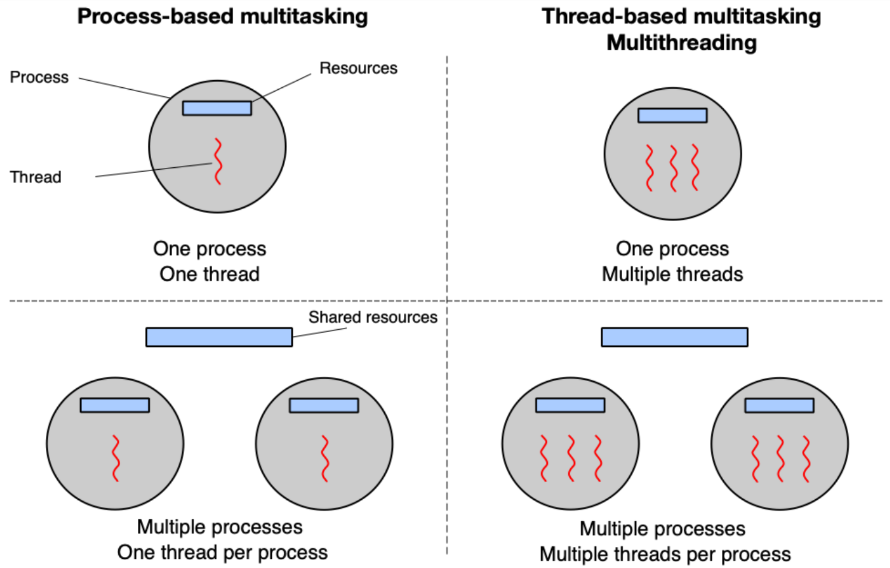
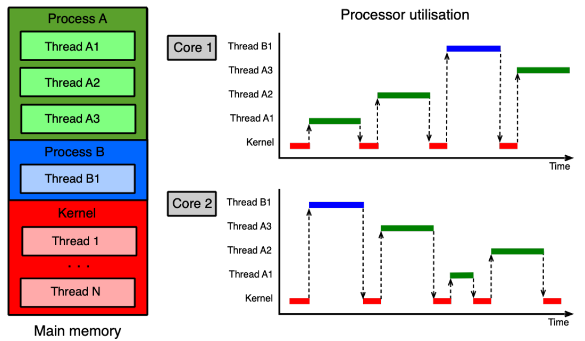
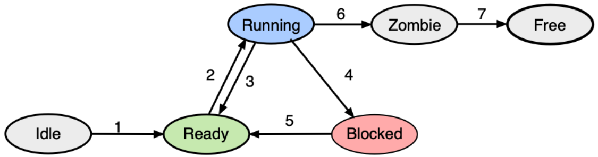

---
author:
- Daniel Hampl
subject: OSY
---

# Procesy a vlákna

**Program** je posloupnost instrukcí definujících chování procesu.

**Proces** je instance spuštěného programu, která slouží k alokování
prostředků (adresový prostor, otevřené soubory, \... ). Informace o
tomto procesu (ID, identita, informace o rodiči a potomcích,\...) jsou
následně uloženy v jádru.

**Vlákno** je část výpočtu, které je přidělován procesor (jádro CPU).
Jádro alokuje pro každé vlákno zásobník (pro historii výpočtu a lokální
proměnné) a udržuje aktuální hodnoty registrů (pro opětovné spuštění)

## Procesy

**Vytvoření**

-   OS inicializuje v jádře datové struktury spojené s novým procesem.

-   OS nahraje kód a data programu z disku do paměti a vytvoří prázdný
    systémový zásobník pro main vlákno.

**Klonovaní**

-   OS zastaví aktuální proces a uloží jeho stav.

-   OS inicializuje v jádře datové struktury spojené s novým procesem.

-   OS udělá kopii aktuálního kódu, dat, zásobníku, stavu procesu,\...

**fork()**

-   Vytvoří nový proces, který je kopií procesu, z kterého byla tato
    funkce zavolána.

-   V rodičovském procesu vrací funkce PID potomka

-   V potomkovi vrací funkce 0

-   Kódový segment sdílí potomek s rodičem.

-   Datový a zásobníkový segment vznikají kopií dat a zásobníku rodiče.

**execve(char \*filename,\...)**

-   V procesu, ze kterého je funkce volána, spustí nový program.

-   Obsah původního procesu je přepsán novým programem.

-   Atributy procesu se nemění (PID, PPID, \...).

**wait(int \*status)**

-   Umožňuje v rodičovském procesu počkat na dokončení potomka.

-   Funkce zablokuje rodičovský proces, ve kterém je zavolána, dokud se
    jeden potomek neukončí.

**Ukončení**

-   Proces se pokusí předat návratový kód rodiči

-   Ukončení všech vláken, která existují v rámci procesu

-   Uvolnění aresového prostoru procesu a jeho datových struktu

## Vlákna

-   Jsou jednotky plánované pro spuštění na CPU

-   Každé vlákno má vlastní:

    -   Hodnotu čítače instrukcí

    -   Hodnotu CPU registrů

    -   Zásobník

-   Ostatní prostředky jsou sdílené

-   Vlákna nejsou nezávislá jako procesy

-   Vlákna sdílí stejný adresový prostor, stejné soubory, potomky a
    reakce na signály

{width=".8\\textwidth"}

**Vytvoření**

-   pthread_create() v POSIXu

-   CreateThread() v MS Win

**Ukončení**

-   pthread_exit() POSIX

-   ExitThread() MS Win

**Přepínání kontextu**

-   Rozdělení vláken jednotlivých procesů mezi jednotlivá jádra

-   Vlákno má svojí dobu, po kterou může běžet na daném jádře, pak je
    prerušeno a je dán čas jinému vláknu

{width=".8\\textwidth"}

**Stavy vláken**

-   Idle: vznik nového vlákna

-   Ready: vlákno čeká až mu bude přiďeleno jádro CPU

-   Running: vlákno je zpracováváno jádrem CPU

-   Blocked: vlákno čeká na událost (dokončení I/O operace, příchod
    signálu,\...)

-   Zombie: vlákno je ukončováno, ale zatím ještě nebylo vše dokončeno

-   Free: vlákno bylo kompletne zrušeno (pouze teoretický stav)

{width=".8\\textwidth"}

# Synchronizace

## Zákaz přerušení (DI)

CPU je přidělováno postupně jednotlivým vláknům za pomoci přerušení od
časovače nebo jiného přerušení. Vlákno zakáže všechna přerušení před
vstupem do kritické sekce a opět je povolí až po jejím opuštění.

### Nevýhody

-   DI od jednoho uživatele blokuje i ostatní

-   V multi-CPU má efekt pouze na aktuální CPU

-   Zpomalí reakce na přerušení

-   Možnost blokovat celé CPU při chybné implementaci

-   Nehodí se pro běžná uživatelská vlákna

## Aktivní čekání vs blokování

Pouze jedno vlákno může do kritické sekce, ostatní mají smůlu

### Aktivní čekání

-   Sdílená proměnná indikuje obsazenost

-   Vlákna ve smyčce testují tuto hodnotu a čekají až budou moci
    postoupit

-   Pokud se dlouho čeká na vstup do kritické sekce, dochází k plýtvání
    časem procesoru

### Blokování

Vlákno provede systémové volání, které ho zablokuje do okamžiku než se
sekce uvolní

## Sdílená proměnná

Vzájemné vyloučení nastavením sdílené proměnné při vstupu do sekce

## Instrukce TSL

-   Test and Set Lock (TSL) - instrukce načte obsah slova do registru a
    nastaví obsah slova na nenulovou hodnotu

-   CPU provádějící TSL lockne paměťovou sběrnici dokud se TSL nedokončí

-   TSL je atomická instrukce

-   TSL lze použít u multi-cpu se sdílenou pamětí

## Instrukce XCHG

-   Alternativa k TSL

-   Exchange instrukce (XCHG) atomicky prohodí obsah slova na dané
    adrese v paměti a registru

## Problémy

### Bez použití synchronizace (časově závislé chyby)

-   Dva a více procesů či vláken používá společné prostředky (sdílená
    paměť, soubor, proměnná)

-   Výsledek je závislý na přepínání kontextu

-   Tyto chyby jsou velmi špatně detekovatelné

### Při použití synchronizace

-   Deadlock = situace kdy se více vláken čeká na událost, kterou může
    vyvolat pouze jedno z čekajících vláken

-   Livelock = situace, kdy několik vláken vykonává neužitečnou činnost
    (mění svůj stav), ale nemohou postoupit k vykonávání usefull práce

-   Hladovění = situace, kdy ready vlákno je předbíháno a nedostane se k
    prostředkům

### Inverzní prioritní problém

-   Vlákno A má nižší prio. a je v kritické sekci

-   Vlákno B má vyšší prio. a čeká pomocí aktivního čekání

-   OS používá prioritní plánování, má 1 jádro na 1 CPU

-   Potom může nastat, je-li priorita fixní, uváznutí

### Synchronizace pomocí blokování

-   Ve většina případů je blokování lepší než aktivní čekání či zákaz
    přerušení

-   Vlákno je zablokováno, pokud chce vstoupit do již zablokované
    kritické sekce, je přesunuto na čekací frontu

-   Tyto operace již na úrovni jádra OS

## Typy synchronizace

-   Blokující send i receive - rendevous

-   Neblokující send a blokující receive

-   Neblokující send i receive + test příchozích zpráv

## Adresování

-   Přímé - Zpráva je uložena přímo do prostoru příjemce

-   Nepřímé - Zpráva je uložena do sdíleného prostoru (mailbox)

# Přidělování prostředků

## Sleep & Wakeup

### wait()

-   Systémové volání

-   Zablokuje vlákno, které ho zavolalo

-   Zakáže alokaci CPU pro toto vlákno a přesune jej do fronty, kde čeká
    na probuzení

### wakeup(thread)

-   Probudí vlákno uspané pomocí wait()

-   Odstraní vlákno z čekací fronty

-   Povolí alokaci CPU

-   Waiting bit

    -   Wakeup volání na neuspané vlákno - bit je nastaven

    -   Uspání vlákna s již nastaveným bitem - vlákno není uspáno, ale
        bit je pouze resetován

## Condition variable

### cond_wait(&var, &mutex)

-   Mutex zamčen a daném vláknu

-   Po zavolání je mutex odemčen a vlákno uspáno

-   Po probuzení je mutex znovu uzamčen

### cond_signal(&var)

Odblokuje alespoň jedno z uspaných vláken

## Semafor

-   Obsahuje čítač a frontu čekajících procesů

-   Instrukce jsou prováděny atomicky (nelze je přerušit)

-   **Init()** Nastavení čítače na zadané číslo a vyprázdní se fronta

-   **Down()** Pokud je čítač \> 0, sníží se o jedna. V opačném případě
    je vlákno uloženo do fronty.

-   **Up()** Pokud je fronta neprázdná, probudí se jedno z čekajících
    vláken. V opačném případě se navýší čítač o jedna.

-   **Monitory** Do bloku je vpuštěno vždy jen jedno vlákno O vyloučení
    v rámci bloku se stará překladač nikoli programátor

-   **wait(c)** Pozastaví vlákno na podmíněné proměnné c

-   **signal(c)** Probudí jedno z pozastavených vláken

## Bariéry

Propouští minimální počet vláken. Když vlákna přijdou k bariéře, tak
čekají, dokud jich není minimální počet, a až poté jsou puštěny dál

# Coffmanovy podmínky

-   Uváznutí nastane pouze pokud jsou splněny následující podmínky.

    1.  **Vzájemné vyloučení:** každý prostředek je buď přidělen právě
        jednomu vláknu a nebo je volný (prostředek nemůže být sdílen
        více vlákny).

    2.  **Podmínka neodnímatelnosti:** prostředek, který byl již
        přidělen nějakému vláknu, nemůže mu být násilím odebrán (musí
        být dobrovolně uvolněn daným vláknem).

    3.  **Podmínka \"drž a čekej\":** vlákno, které má již přideleny
        nějaké prostředky, může žádat o další prostředky (vlákno může
        žádat o prostředky postupně).

    4.  **Podmínka kruhového čekání:** musí existovat smyčka dvou nebo
        více vláken, ve které každé vlákno čeká na prostředek přidelený
        dalšímu vláknu ve smyčce.

-   První tři podmínky jsou nutné ale ne dostačující $\implies$ k
    uváznutí může dojít. Poslední podmínka představuje samotné uváznutí.

-   Pokud aspon jedna z podmínek není splněna, nemůže dojít k uváznutí.

# Uváznutí

## Způsoby řešení uváznut

### Pštrosí algoritmus

Úplné ignorování celého problému.

### Detekce a zotavení

K uváznutí může dojít, ale pak je detekováno a odstraněno

Zotavení pomocí odebrání - násilné odebrání prostředku

Zotavení pomocí návratu - při detekci uváznutí je proces vrácen zpět v
čase

Zotavení pomocí ukončení procesů - ukončení procesu ze smyčky alokačního
grafu

### Pečlivá alokace prostředků

### Prevence pomocí nesplnění aspoň jedné z Coffmanových podmínek

# Příklady

## Večeřící filosofové

Model vláken, které soutěží o výlučný přístup k omezenému počtu
prostředků.

N filozofů sedí kolem kulatého stolu a každý z nich buď přemýšlí nebo
jí. K jídlu potřebuje současně levou a pravou vidličku.

Řešení:

-   Pomocí mutexu

-   Ověřovani že můžeme vzít obě vidličky (atomické)

-   Upozornění sousedů po skončení

-   Sousedi blokováni mutexem než dostanou upozornění

## Čtenáři - písaři

Model vláken, které přistupují do společné databáze.

Více čtenářů může číst současně data pokud žádný písař nemodifikuje data
v databázi.

Pouze jeden písař může modifikovat data v databázi v jednom okamžiku.

Řešení:

-   Pomoc mutexu a counteru

-   Uzavírání DB při psaní

-   Reader čeká než může číst

-   Reader notifikuje writer když už nikdo nečte

-   Writer čeká než může psát

-   Writer notifikuje reader když už nepiše

## Producent - konzument

**Producent** produkuje data a vkládá je do sdílené fronty s omezenou
kapacitou

**Konzument** vybírá data ze sdílené fronty.

Řešení:

-   Tři mutexy

-   Jeden pro prřístup do fronty

-   Jeden pro stav full (konzument čeká)

-   Jeden pro stav empty (producent čeká)
