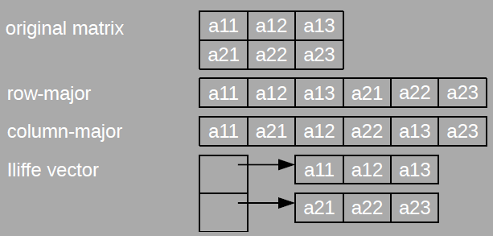

# Abstraktní datový typ

Abstraktní datové typy (ADT) definují množinu hodnot a operací nezávisle
na konkrétní implementaci.

## Specifikace

ADT může být formálně specifikován signaturou operací a množinou axiomů.

-   axiomy jsou ekvivalence mezi výrazy, každý výraz reprezentuje stav

-   výrazy jsou složené z operací a proměnných

-   axiomy mohou být použity pro zjednodušení komplexnějších výrazů

{#ADT_SIGNATURE_AXIOM
width="50%"}

## Implementace

Některé programovací jazyky (například Clear) dovolují formální
specifikace ADT. Imperativní (a OOP) jazyky vyžadují explicitní
implementaci ADT. V C++ je doporučeno implementovat ADT generickými
třídami:

-   typ prvku je generickým parametrem šablony třídy

-   operace init je implementována konstruktorem

-   implementace obvykle používá dynamicky alokovanou paměť, proto je
    často vyžadován i destruktor, kopírující konstruktor a přetížený
    operátor =

-   když je signatura operace ADT, $\dots \rightarrow elem$ je
    doporučená implementace const metodou vracející T

-   když je signatura operace ADT, $\dots \rightarrow ADT$ je doporuřeno
    implementace metodou modifikující objekt

# Struktury

## Zásobník

### Implementace

-   pole pevné délky, kapacita je omezena už při kompilaci

-   dynamicky alokované pole, velikost pole je dána parametrem
    konstruktoru

-   dynamicky alokované pole, velikost pole se mění

-   spojový seznam

Časová složitost je konstantní jak pro metodu push, tak pro pop. Jen pro
dynamicky alokované pole s měnící se velikostí se liší:

-   když je velikost pole měněna při každém push, složitost push je
    lineární

-   když je velikost pole zdvojnásobována (nebo víc), je režije
    amortizována a push by byl průměrně konstantní

## Fronta

### Popis

Fronta je sekvenční kontejner organizovaný FIFO způsobem. Způsoby
implementace:

### Implementace

-   polé pevné délky, kapacita (maximální počet prvků ve frontě) je
    omezena už při kompilaci

-   dynamicky alokované pole, velikost pole je dána parametrem
    konstruktoru, opět omezená paměť

-   dynamicky alokované pole, velikost je měněna vždy, když je potřeba

-   spojový seznam (jednosměrně zřetězen)

Časová složitost je konstatní (pro push i pop). Jediná výjimka je
dynamicky alokované pole s měnící se velikostí, zde může být složinost
až O(n), ale průměrná může být stále konstatní při exponenciálním
nárustu velikosti.

## Pole

### Popis

Pole je datový kontejner, který organizuje prvky v n-dimenzionálním
prostoru:

-   náhodný přístup k prvkům s konstantní časovou složitostí

-   prvek je identifikován n-ticí indexů (celých čísel)

### Implementace - jednodimenzionální pole

array\[$l_1 \dots h_1$\] Prvky uloženy v kontinuálním paměťovém bloku,
velikost bloku: ($(h_1 - l_1 + 1) * sizeof(T)$). Funkce zajišťující
přístup k prvku (mapovací funkce map(i)) je ofset prvku od počátečního
bloku. Jednodimenzionální pole má jednoduchou mapovací funkci:
$map(i) = (i - l_1)$. Protože pole v C/C++, Javě, C\#\... má vždy
$l_1 = 0$, tak je mapovací funkce ještě jednodušší = $map(i) = i$

### Implementace - multidimenzionální pole

array\[$l_1 \dots h_1,l_2 \dots h_2,\dots,l_n \dots h_n$\] Jediný
kontinuální blok, serializace \"po řádcích\" (nejpravější index roste
nejrychleji). Jediný kontinuální blok, serializace \"po sloupcích\"
(nejlevější index roste nejrychleji). Přístupové vektory (lliffe-ho
vektory).

{width="40%"}

## Seznam

### Popis

Seznam je datová struktura, která poskytuje operace insert, remove a
read. Operace jsou určeny pozicí v seznamu. Pozice může být měněna.

### Implementace

Požadujeme konstantní časovou složitost pro všechny operace. Proto
nemůže být použito pole. Struktura zřetězeného seznamu dovoluje
provádění vložení a rušení s konstantní časovou složitostí. Obousměrně
zřetězený seznam je použit pro dosažení konstantního času i pro operaci
*o jedno zpět(toPrev)*. Pro operaci *na konec (toEnd)* je použit
ukazatel na konec pole.

## Množina

### Popis

Kontejner, který obsahuje prvky typu T, bez duplikátů. Základní
interface:

-   vložení prvku (insert)

-   odstranění prvku (remove)

-   test přítomnosti prvku

### Implementace

-   indikátorový (charakteristický) vektor

-   pole (neseřazené)

-   pole (seřazené)

-   spojový seznam (jednosměrný, neseřazený)

-   spojový seznam (jednosměrný, seřazený)

-   binární vyhledávací strom

-   rozptylovací funkce (hash table)

### Implementace - indikátorový vektor

Funkce, který má hodnotu 0 pro prvky nepatřící do množiny 1 pro prvky v
množině obsažené. Když je universum konečné a dostatečně malé, může být
funkce implementována jako vektor. Vektor obsahuje hodnoty typu bool
nebo je to bitové pole. Implementace je rychlá:

-   insert(x) - O(1)

-   del(x) - O(1)

-   isSet(x) - O(1)

Jiné operace:

-   průnik - vytvoření nové množiny, procházení jedné množiny (O(n)) a
    testování existence v druhé (O(1)) = O(n) celkem

-   sjednocení - vytvoření nove množiny, procházení prvků první množiny
    (O(n)), vkládání jejich prvků (to samé i pro druhou množinu) = O(n +
    n) = O(n)

-   porovnání - porovnávají se všechny prvky obou množin - O(n)

### Implementace - neseřazené pole

Neseřazené prvky jsou umístěny v poli, které je dynamicky alokované a
jeho velikost se mění. Třída musí mít přehled o velikosti pole a o počtu
prvků v množině.

-   insert(x) - nový prvek se umístí na konec pole (O(1)). To může
    způsobit duplicitu. Proto se musí nejdříve otestovat projitím pole
    (O(n)) = O(n)

-   del(x) - prochází se pole (O(n)) a když je prvek nalezen, nahradí se
    posledním prvkem pole (O(1)) = O(n)

-   isSet(x) - hledá se v poli (O(n)) = O(n)

Jiné operace:

-   průnik - vytvoření nové množiny, procházení prvků první množiny
    (O(n)) a test přítomnosti v druhé množině (O(m)) = O(n\*m)

-   sjednocení - vytvoření nové množiny, procházení prvků první množiny
    a vkládání jejích prvků (O(n)). Pak procházení druhé množiny +
    kontrola existence (O(n\*m)) = O(n\*m)

-   porovnání - porovnává se obsah polí (kvadratický algoritmus):
    O(n\*m)

### Implementace - seřazené pole

Seřazené prvky jsou umístěny v poli, které je dynamicky alokované a jeho
velikost se mění. Třída musí mít přehled o velikosti pole a o počtu
prvků v množině.

-   insert(x) - místo pro vložení se najde binárním hledáním (O(log n)).
    Pak ale prvky za tímto místem musí být odsunuty pravo (O(n)) = O(n)

-   del(x) - prvek se najde binárně (O(log n)), ale opět se musí
    posunout (O(n)) po vymazání = O(n)

-   isSet(x) - v poli se hledá binárně (O(log n)) = O(log n)

Jiné operace:

-   průnik - vytvoří se nová množina, obě se projdou simultánně. Vloží
    se vždy jeden ze stejných prvků = O(max(n, m))

-   sjednocení - vytvoření nové množiny, obě množiny se procházejí
    sumultánně. Vloží se všechny prvky (stejné jen jednou) = O(max(n,
    m))

-   porovnání - porovnají se pole (lineární algoritmus) = O(max(n, m))

### Implementace - spojový seznam

Neseřazený spojový seznam: implementace je stejná jako u neseřazeného
pole. Seřazený spojový seznam: implementace vložení/odstranění/test
přítomnosti je stená jako u neseřazeného pole.
Sjednocení/průnik/porovnání mohou být implementovány lépe - jako u
seřazeného pole. Implementace spojovým seznamem má větší režii na paměť
než seřazené pole.

## Tabulka (Mapa, Slovník)

### Popis

Kontejner, který obsahuje dvojice klíč-hodnota. Klíče jsou unikátní.
Základní interface:

-   *init: -\> Map*,

-   vložení klíče s hodnotou (insert) *ins(\_,\_,\_): Key, Val, Map -\>
    Map*,

-   odstranění klíče s hodnotou (remove) *del(\_,\_): Key, Map -\> Map*,

-   test přítomnosti klíče *isSet(\_,\_): Key, Map -\> bool*,

-   výběr hodnoty podle klíče *read(\_,\_): Key, Map -\> Val*.

Lze iterovat přes dvojice klíč-hodnota nebo pouze přes klíče nebo pouze
přes hodnoty.

Mapy a množiny jsou podobné. Množinu můžeme považovat za speciální
případ mapy, kde hodnoty jsou typu *bool*.

### Implementace

-   pole - přímý přístup (klíče jsou indexy v poli)

-   pole (neseřazené)

-   pole (seřazené)

-   spojový seznam (jednosměrný, neseřazený)

-   spojový seznam (jednosměrný, seřazený)

-   binární vyhledávací strom

-   rozptylovací funkce (hash table)

### Implementace - pole - přímý přístup

Klíče mohou být pouze celá čísla z intervalu 0 až maximální délka pole.
Nepřítomnost prvku musí být určena speciální hodnotou (například NULL).
Implementace je rychlá:

-   insert(k, v) - O(1)

-   del(k) - O(1)

-   isSet(k) - O(1)

-   read(k) - O(1)

### Implementace - neseřazené pole

Pole obsahuje neseřazené páry klíč-hodnota. Nové prvky jsou přidávány na
konec pole. Při hledání klíče se musí projít celé pole.

-   insert(k, v) - nový prvek se umístí na konec pole (O(1)). To může
    způsobit duplicitu. Proto se musí nejdříve otestovat projitím pole
    (O(n)) = O(n)

-   del(k) - prochází se pole (O(n)) a když je prvek nalezen, nahradí se
    posledním prvkem pole (O(1)) = O(n)

-   isSet(k) - hledá se v poli (O(n)) = O(n)

-   read(k) - hledá se v poli (O(n)) = O(n)

Jiné operace:

### Implementace - seřazené pole

Pole obsahuje seřazené páry klíč-hodnota. Při hledání klíče se využije
binární vyhledávání.

-   insert(k,v) - místo pro vložení se najde binárním hledáním (O(log
    n)). Pak ale prvky za tímto místem musí být odsunuty pravo (O(n)) =
    O(n)

-   del(k) - prvek se najde binárně (O(log n)), ale opět se musí
    posunout (O(n)) po vymazání = O(n)

-   isSet(k) - v poli se hledá binárně (O(log n)) = O(log n)

-   read(k) - v poli se hledá binárně (O(log n)) = O(log n)
