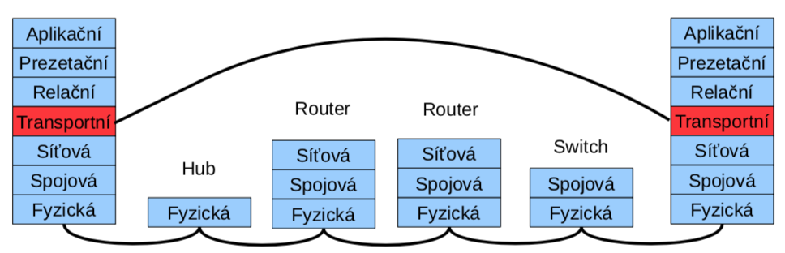

# ISO/OSI model

Tento model se osvědčil pro popis sítí a protokolů, ovšem univerzálním
standardem pro reálné sítě se nestal. Přišel ve špatnou dobu, nebyly
vhodné technologie a není žádná úspěšná implementace.

   \#  Jméno vrstvy          Data       Funkce/protokol
  ---- --------------------- ---------- ---------------------------------------
   7   Aplikační             Data       Komunikace s aplikací - SMTP, HTTP
   6   Prezenční             Data       Reprezentace dat, komprese, šifrování
   5   Relační (session)     Data       Udržování relace
   4   Transportní           Segments   End-to-end spojení - UDP, TCP
   3   Síťová                Packets    IP (logické adresování) - IP, IPX
   2   Linková (data-link)   Frames     MAC (fyzické adresování) - Ethernet
   1   Fyzická               Bits       Bitový přenos - RS232, ADSL

{width="\\textwidth"}

::: {#fyzickuxe1-vrstva}
## Fyzická vrstva {#fyzickuxe1-vrstva}
:::

-   zajišťuje přenos bitů kanálem

-   definuje způsob přenosu 0 a 1 (napěťové vlastnosti, modulace)

-   definuje elektrické a mechanické vlastnosti média

::: {#linkovuxe1-vrstva}
## Linková vrstva {#linkovuxe1-vrstva}
:::

-   funkce spolehlivého spojení (detekce případně korekce chyb)

-   řízený přístup k lince (MAC - Medium Access Control)

-   řízení toku na lince

-   jednoznačná adresa v segmentu sítě (např. MAC v Ethernetu)

-   na této vrstvě pracují všechny bridge a switche

::: {#suxedux165ovuxe1-vrstva}
## Síťová vrstva {#suxedux165ovuxe1-vrstva}
:::

-   adresace a směřování dat přes mezilehlé prvky

-   síťová adresa - jednoznačná adresa v rámci celé sítě (např. IP
    adresa)

-   na této vrstvě pracují routery

::: {#transportnuxed-vrstva}
## Transportní vrstva {#transportnuxed-vrstva}
:::

-   rozklad dat na pakety

-   uspořádání paketů podle pořadí

-   multiplexuje a demultiplexuje data mezi jednotlivými spoji

-   transportní adresy (adresa, port)

::: {#relaux10dnuxed-vrstva}
## Relační vrstva {#relaux10dnuxed-vrstva}
:::

-   vytváření logického rozhraní pro aplikace

-   synchronizace spojení (transakce)

-   přihlášení, udržování relace

-   např. sdílení disků

::: {#prezenux10dnuxed-vrstva}
## Prezenční vrstva {#prezenux10dnuxed-vrstva}
:::

-   formátování a prezentace dat

-   transformace (komprese/dekomprese)

-   kódování (např. různé jazyky)

-   šifrování

-   např. ASCII/EBCDIC

::: {#aplikaux10dnuxed-vrstva}
## Aplikační vrstva {#aplikaux10dnuxed-vrstva}
:::

-   způsob komunikace aplikací - protokoly

-   podpůrné funkce aplikacím

-   představuje interface pro uživatele

# TCP/IP model

Vznikl na akademické půdě, bez podílu komunikačních firem. Úspěšný
hlavně díky internetu. Model vnikl dodatečně, nejprve existovaly
protokoly.

Rozdíly oproti ISO/OSI: vynechány vrstvy prezenční a relační. A proběhlo
sloučení fyzické a linkové vrstvy.

Vrstvy:

   \#  Jméno vrstvy      Jednotka na vrstvě
  ---- ----------------- --------------------
   4   Aplikační         TCP segment
   3   Transportní       IP datagram
   2   Síťová            Ethernet frame
   1   Síťové rozhraní   bity

{width="\\textwidth"}

# Protokoly linkové vrstvy {#protokoly-linkovuxe9-vrstvy}

Zodpovídají za přenos dat mezi propojenými systémy a mohou také
zajišťovat spolehlivost přenosu či adresaci v rámci segmentu - MAC. MAC
= Medium access control. Unikátní ID zařízení. Přiděleno výrobcem. 6
oktetů. Obsahuje doplňkový znak (byte stuffing), je to flag, který udává
začátek a konec rámce. Také obsahuje doplňkový bit (bit stuffing).

-   HDLC - bitově orientovaný protokol

-   SLIP

    -   definuje pouze zapouzdření paketů seriové lince

    -   rámec označen znaky END

    -   speciální znaky: END a ESC

-   PPP

    -   Point to point protocol

    -   podmnožina HDLC

    -   bitové spoje - bit stuffing

# Potvrzovací metody {#potvrzovacuxed-metody}

::: {#pozitivnuxed-potvrzovuxe1nuxed}
## Pozitivní potvrzování {#pozitivnuxed-potvrzovuxe1nuxed}
:::

-   každý rámec musí být potvrzen (ACK)

-   pokud nedojde potvrzení do určitého času (timeout) je rámec odeslán
    znova

\#\#\# Negativní potvrzování - přijímací strana potvrzuje - lze odeslat
i negativní potvrzení (NAK) - paket nedošel nebo je poškozen -
nepřijde-li ACK ani NAK uplatní se timeout

::: {#ux10duxedslovuxe1nuxed-ruxe1mcux16f-frame-numbering}
## Číslování rámců (frame numbering) {#ux10duxedslovuxe1nuxed-ruxe1mcux16f-frame-numbering}
:::

-   pakety jsou cyklicky číslovány (0-n)

-   přijímací strana potvrdí číslem paketu, který očekává jako další

-   snadná identifikace duplicit

::: {#klouzavuxe9-okuxe9nko-sliding-window}
## Klouzavé okénko (sliding window) {#klouzavuxe9-okuxe9nko-sliding-window}
:::

-   stejné jako u "frame numbering", ale lze odeslat více rámců bez
    potvrzení

# Přepínání (switching) {#pux159epuxednuxe1nuxed-switching}

-   switche nahrazují "hloupé" huby

-   pamatují si přiřazení MAC k fyzickým portům (časem záznamy maže)

    -   tabulka dvojic (fyzický port, MAC adresa)

-   pokud má záznam, tak odešle pouze na daný fyzický port

-   pokud nemá, tak odešle na všechny porty, stejně jako broadcast
    (adresa `FF:FF:FF:FF:FF:FF`)

-   snížení zátěže linek a zvýšení bezpečnosti (omezení odposlouchávání)

-   2 různé metody:

    -   store-and-forward - přijme, analyzuje a odešle (zahodí neplatné)

    -   cut-throught - odešle hned a průběžně analyzuje (je rychlejší)

# Směrování (routing) {#smux11brovuxe1nuxed-routing}

Existuje několik přístupů.

::: {#zuxe1plavovuxe9}
## Záplavové {#zuxe1plavovuxe9}
:::

-   doručení v nejkratším možném čase

-   omezená životnost paketu (TTL v hlavičce)

-   paket se duplikuje exponenciálně (lze zapamatovat a zpracovávat jen
    jednou)

-   velmi neefektivní

::: {#nuxe1hodnuxe9}
## Náhodné {#nuxe1hodnuxe9}
:::

-   paket odeslán náhodnou výstupní linkou

-   nezaručuje konečnou dobu doručení

-   lze využít jako doplněk k jiným algoritmům (např. při zahlcení
    výstupní linky)

::: {#statickuxe9}
## Statické {#statickuxe9}
:::

-   směrovací tabulka dána konfigurací

-   nereaguje na stav sítě (včetně poruch)

-   př.: počítač v lokální síti (2 hodnoty - lokální síť a GW)

::: {#dynamickuxe9}
## Dynamické {#dynamickuxe9}
:::

-   mění se v závislosti na stavu sítě

-   způsoby aktualizace

    -   izolovaně

    -   centralizovaně

    -   necentralizovaně

        -   např. algoritmus LSA (Link State Algorithm) - routery si
            předávají info. o stavu linek, všichni znají komplet.
            topologii, pomocí Dijkstrova algoritmu se hledají nejkratší
            cesty

# Principy fungování propojovacích síťových prvků {#principy-fungovuxe1nuxed-propojovacuxedch-suxedux165ovuxfdch-prvkux16f}

Pro propojení se používají tyto prvky:

-   Repeater: zesiluje signál, pracuje na fyzické vrstvě

-   Hub (rozbočovač): rozešle přijatý paket na všechny své porty,
    pracuje na fyzické vrstvě

-   Bridge: propojuje dvě sítě, pracuje na linkové vrstvě, odděluje
    kolizní segmenty

-   Switch: linková vrstva, narozdíl od hubu pamatuje si přiřazení adres
    MAC k portům (tabulka \[MAC, port\]), přepíná pakety mezi porty, v
    podstatě bridge s více než 2mi porty

-   Router: propojuje sítě na síťové vrstvě, provádí směrování paketů po
    sítí, není závislý na fyzické technologii, směruje po různých
    technologiích
