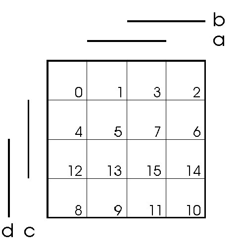

# Kombinační a sekvenční logické obvody (Mealy, Moore)

## Kombinační

Výstup je dán kombinací vstupů, nezáleží na stavu.\
Matematický model -- logická funkce.

## Sekvenční

Výstup závisí na posloupnosti vstupů, realizuje se zpětnými vazbami.\
Matematický model -- konečný automat.

asynchronní

:   bez hodinového vstupu

synchronní

:   s hodinovým vstupem

## Moore

Reaguje na vstup až při přechodu do dalšího stavu. Výstup je v uzlech.

## Mealy

Reaguje na vstup ihned. Výstup je v přechodech.

# Popis a možnosti implementace na úrovni hradel.

Kombinační obvody lze popsat:

-   Logická funkce (např.: $X = \overline{A}\cdot B + A\cdot B$)

-   Mapa

-   Krychle

-   Tabulka

-   Graf přechodů

-   Popis stavů a přechodových funkcí (např.:
    $(X,Y,S,S_0,\delta,\lambda)$)

  -------------------------- -------------------------------
  $X$                        ...množina vstupních symbolů
  $Y$                        ...množina výstupních symbolů
  $S$                        ...množina stavů
  $S_0$                      ...počáteční stav
  $\delta(s\in S)$           ...výstupní funkce u Moorea
  $\delta(s\in S,x\in X)$    ...výstupní funkce u Mealyho
  $\lambda(s\in S,x\in X)$   ...přechodová funkce
  -------------------------- -------------------------------

## Na úrovni hradel - diagram

(N)AND, (N)OR, (N)XOR, NOT

{width="8cm"}

Dekodér 1 z N

:   -- vybírám adresu, aby mi svítila jedna žárovka

Multiplexor

:   -- vybírám bit, kterej chci , přes jeden kabel

Demultiplexor

:   -- opak multiplexoru

Sčítačka (poloviční, úplná)

:   -- sčítá dva bity (ta úplná počítá i s přenosem z předchozích řádů).
    Úplné sčítačky se dají nakombinovat, aby se dalo sečíst binární
    číslo.

# Minimalizace vyjádření logické funkce (s využitím map).

-   MNDF - minimální normální disjunktní forma

-   MNKF - minimální normální konjunktivní forma

## Postup pro vytvoření MNDF

1.  Napíšu si pravdivostní tabulku, co chci za vstupy.

2.  Zapíšu jedničky (případně křížky - Don't care) do Karnaugovy mapy.

3.  V mapě najdu co největší skupiny o velikostech mocnin.

4.  Skupiny přepíšu do funkce tak, že zapíšu proměnné, které nemění
    svoji hodnotu.

{width="8cm"}

Příklady na procvičení jsou na
<https://courses.fit.cvut.cz/BI-SAP/media/seminars/kap3.pdf>.
