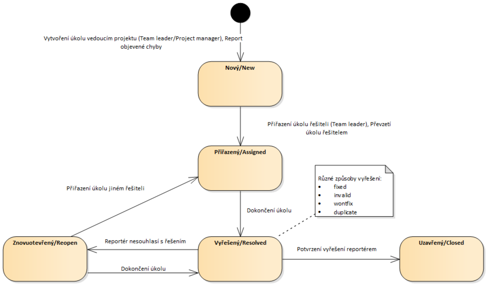

---
author:
- Jakub Rathouský
subject: SI1.2
---

# Správa úkolů, požadavků, chyb

Pomáhá vyřešit organizaci práce v týmu

-   evidence úkolů - co je nutné udělat

-   přidělování - kdo to bude dělat

-   plánování - do kdy je nutné úkol udělat

-   kontrola splnění úkolů

-   vyhodnocení odvedené práce

## Používané nástroje

-   Trac tickets

-   Mantis

-   Bugzilla

-   JIRA

-   GitLab/Github

-   Redmine

-   Youtrack

## Typický životní cyklus úkolu/chyby

Kroky:

-   Team leader/project manager vyvoří úkol/nahlášení chyby
    $\rightarrow$ stav ***Nový(New)***

-   přiřazení úkolu řešiteli (Team leader), převzetí úkolu řešitelem
    $\rightarrow$ stav ***Přiřazemý(Assigned)***

-   dokončení úkolu $\rightarrow$ stav ***Vyřešený(Resolved)***

    -   reportér nesouhlasí s řešením $\rightarrow$ stav
        ***Znovuotevřený(Reopen)***

        -   dokončení úkolu $\rightarrow$ stav ***Vyřešený(Resolved)***

        -   nebo přiřazení úkolu jinému řešiteli $\rightarrow$ stav
            ***Přiřazený(Assigned)***

    -   nebo potvrzení vyřešení reportérem $\rightarrow$ stav
        ***Uzavřený(Closed)***

{width="100%"}

# Sdílení a správa souborů

## Hlavní přínosy

Řeší více dílčích problémů

-   verzování

    -   udržuje kompletní historii každého souboru pod správnou verzí

    -   lze se k jednotlivým verzím v minulosti kdykoliv vrátit

-   zálohování

    -   v případě poškození/ztráty souborů je možné je obnovit

## Používané nástroje

-   centralizované

    -   SVN

    -   CVS

-   distribuované

    -   GIT

    -   Mercurial

### Centralizované nástroje

-   veškeré revize/verze souborů jsou uloženy pouze v centrálním
    repozitáři

-   na lokálním počítači je pouze pracovní kopie (aktuální revize/verze)
    souborů

### Distribuované nástroje

-   na lokálním počítači jsou uloženy všechny revize/verze

-   díky tomu může být velká část operací prováděna lokálně

## Principy řešení spolupráce

Dělí se na dva principy

-   zamknutí - úprava - odemknutí (lock - modify - unlock) $\rightarrow$
    pouze centralizované systémy

-   kopie - úprava - sloučení (copy - modify - merge) $\rightarrow$
    centralizované i distribuované systémy

### zamknutí - úprava - odemknutí

-   může způsobit organizační problém

    -   zbytečně blokovaní práce uživatelů při zapomenutí odemknutí po
        dokončení práce

    -   nutnost násilného uvolnění zámku, které může způsobit ztrátu
        odvedené práce

-   vynucuje serializovaný přístup i při nekonfliktních úpravách

-   využítí pro soubory, které nelze po částech sloučit (grafika,
    modely\...)

### kopie - úprava - sloučení

-   častěji využívaný způsob spolupráce

-   odstaňuje problémy zamykacího režimu

-   v případě konfliktních změn je nutné provést ruční sloučení
