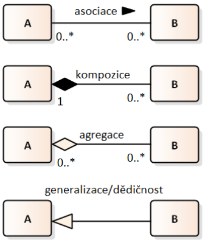
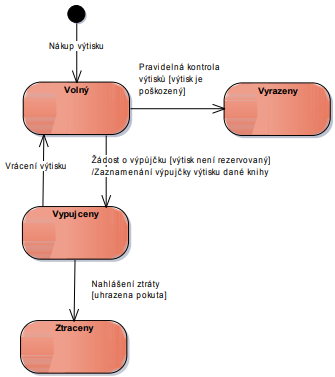

---
author:
- Jakub Rathouský
subject: SI1.2
---

# Analytický doménový model tříd

Model pomáhající definovat entity v problémové doméně, jejich vlastnstí
a vztahů mezi nimi. Modeluje se diagram tříd, ale vynechávají se
implementační detaily.

## Cíle

-   popsat data

-   popsat význam termínů

-   popsat vazby mezi entitami

-   identifikovat stav entity

-   základ pro design (db model, model tříd)

-   zachycení atributů

# Popis životního cyklu identifikovaných tříd (cíle, UML diagram tříd, UML stavový diagram)

## Doménový model

-   pomocí diagramu tříd UML

-   patří do skupiny diagramů struktur

-   využití:

    -   business doménový model

    -   analytický doménový model

    -   databázový model

    -   návrh modelu tříd

-   třída v diagramu se skládá z:

    -   atributů

    -   metodami

    -   viditelnost

-   typy vztahů:

    -   asociace

        -   udržení vztahu mezi dvěmi entitami

        -   ty mohou existovat nezávisle na sobě

        -   výchozí směr na obě strany

        -   lze přidat šipky pro upřesnění

    -   kompozice

        -   podobná jako agregace, akorát silnější

        -   entita části nemá smysl bez celku

    -   agregace - raději nepoužívat

        -   reprezentuje vztah celek - část

        -   celek si drží kolekci objektů

        -   část může existovat samostatně a nebo ve více kolekcích

    -   generalization / dědičnost

-   násobnosti

    -   0-\* ...

    -   1-\* ...

    -   0-\* ...1

    -   ...

-   popis vztahů

{width="20%"}

## Atribut vs Vazba

-   význam shodný

-   důležitá je čitelnost

-   vazba je názornější

## Hledání tříd

-   předměty, objekty reálného světa

-   podstatná jména z vytvořených dokumentů

    -   business model

    -   UC model

    -   slovníček pojmů

-   rozpracování business doménového modelu

# Stavový diagram

## Cíle

-   porozumět životnímu cyklu entit

-   vyjasnění stavů, ve kterých se může entita nacházet

-   zachycení událostí vyvolávajících přechod a podmínek, za kterých
    může změna nastat

## Notace

-   stavový diagram

    -   patří do skupiny diagramů chování

    -   konečné stavové automaty

-   skládá se z:

    -   stav

    -   přechody - události

{width="40%"}
