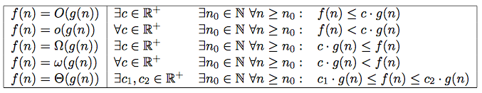
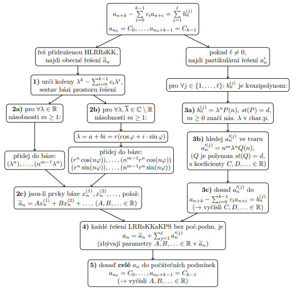

---
author:
- Daniel Hampl
subject: ZDM
---

# Rekurentní rovnice

## Obecná rekurentní rovnice

Obecnou rekurentní rovnicí rozumíme jakýkoliv vztah typu

$a_{n+k}=f(a_{n+k-1},a_{n+k-2},...,a_n,n).$

Nadále se ale budeme spíše zabývat lineárními rekurentními rovnicemi
řádu $k \in \mathbb{N}$:

$a_{n+k} + c_{k-1}(n) a_{n+k-1} + · · · + c_1(n) a_{n+1} + c_0(n) a_n = b_n$
pro každé $n \geq n_0$,

kde:

-   $n \geq n_0$

-   $n_0 \in \mathbb{Z}$

-   $c_i(n)\ pro\ i = 0, . . . , k-1$ jsou funkce
    $\mathbb{Z} \rightarrow \mathbb{R}$

-   $c_0(n) \neq 0$

-   $\{b_n\}^\infty_{n = n_0}$ (pravá strana rovnice)

-   $\{a_n\}^\infty_{n=n_0}$ (řešení)

-   pokud $\{\bar{a_n}\}^\infty_{n=n_0}$ je řešení, potom je
    $\{a_n\}^\infty_{n=n_0}$ řešením této rovnice právě tehdy, když se
    dá zapsat jako
    $\{a_n\}^\infty_{n=n_0} = \{\bar{a_n}\}^\infty_{n=n_0} + \{\tilde{a_n}\}^\infty_{n=n_0}$,
    kde $\{\tilde{a_n}\}^\infty_{n=n_0}$ je nějaké řešení přidružené
    homogení rovnice.

## Rekurentní rovnice s konstantími koeficienty (LRRsKK)

Lineární rekurentní rovnice řádu k s konstantními koeficienty je
libovolná rekurentní rovnice ve tvaru:

$a_{n+k} + c_{k-1}a_{n+k-1} + · · · + c_1a_{n+1} + c_0a_n = b_n$

-   $n \geq n_0$

-   $n_0 \in Z$

-   $c_i \in R$ pro $i = 0, . . . , k - 1$ jsou konstanty

-   $c_0 \neq 0$

-   $\{b_n\}^\infty_{n = n_0}$ (pravá strana rovnice)

-   $p(\lambda) = \lambda^k + c_{k-1}\lambda^{k-1} + · · · + c_1\lambda + c_0$
    je charakteristický polynom této rovnice

-   $\lambda$ je chararistické, či vlastní číslo

-   $\{\lambda^n\}^\infty_{n = n_0}$ je řešení homogení LRRsKK, pokud je
    $\lambda$ vlastní číslo této LRRsKK

-   pokud existuje $k$ ruzných $\lambda_i$, potom posloupnosti
    $\{\lambda^n_i\}^\infty_{n = n_0}$ tvoří bázi prostoru řešení
    přidružené homogenní rovnice (stačí najít prvních $k$ členů)

-   pokud je $\lambda$ m-násobným kořenem charakteristického polynomu,
    tak posloupnosti
    $(\lambda^n), (n\lambda^n), \dots, (n^{m-1}\lambda^n)$ jsou řešením
    přidružené homogenní rovnice

## Moivre-ova věta

$\alpha \pm i\beta = r[\text{cos}(\Phi) \pm i\text{sin}(\Phi)] \implies (\alpha \pm i\beta)^n = r^n[\text{cos}(n\Phi) \pm i\text{sin}(n\Phi)]$

Tuto větu použijeme při hledání dvou nezávislých realných posloupností.

# Řešení

## Substituční metoda

-   Odhadneme (uhádneme) tvar řešení (=indukční hypotéza).

-   Pomocí matematické indukce nalezneme konstanty a ověříme správnosti
    odhadnutého řešení

-   Využívá se k odhadu horní a dolní meze

Uvažujme rovnici $t(n) = 2t(\lfloor n/2 \rfloor) + n$. Jako horní odhad
řešení zkusme $t(n) \leq cn~\text{log}~n$, kde $c > 0$ je vhodně zvolená
konstanta. Indukcí dokážme správnost odhadu, tedy že pro řešení rovnice
platí $t(n) =\nolinebreak O(n~\text{log}~n)$.

Indukční krok (ověření, že $t(n) \leq cn~\text{log}~n$ vyhovuje
rekurenci $t(n) = 2t(\lfloor n/2 \rfloor) + n$) Předpokládejme, že platí
pro $\lfloor n/2 \rfloor$ a dosaďme
$t(\lfloor n/2 \rfloor) \leq c \lfloor n/2 \rfloor~\text{log}~ \lfloor n/2 \rfloor$
do počáteční rovnice. Dostaneme

$$\begin{aligned}
t(n) &\leq 2(c \lfloor n/2 \rfloor \log{\lfloor n/2 \rfloor}) + n\\
     &= cn \log{(n/2)} + n\\
     &= cn \log{ n} - cn \log{} 2 + n\\
     &= cn \log{ n} - cn + n\\
     &= cn \log{ n} - (c - 1)\cdot n\\
     &\leq cn\log{n}\text{, pokud }c \geq 1\end{aligned}$$

## Iterační metoda

-   Expandujeme rovnici dle iterací a získáme rozvoj na konečnou řadu a
    zkusíme najt aritmetickou či geometrickou posloupnost

-   Využívá se k odhadu horní a dolní meze

Uvažujme rovnici $t(n) = 3t(\lfloor n/4\rfloor) + n$ Protože platí
$\lfloor \lfloor n/4\rfloor /4\rfloor = \lfloor n/4^2 \rfloor$ atd.,
postupnou iterací dostaneme $$\begin{aligned}
t(n) &= n + 3t(\lfloor n/4 \rfloor)\\
     &= n + 3 \lfloor n/4\rfloor + 3^2t(\lfloor n/4^2 \rfloor)\\
     &= n + 3 \lfloor n/4 \rfloor + 3^2\lfloor n/4^2 \rfloor + 3^3t(\lfloor n/4^3 \rfloor)\\
     &= . . .\\
     &= n + 3 \lfloor n/4\rfloor + 3^2 \lfloor n/4^2 \rfloor + 3^3 \lfloor n/4^3 \rfloor) + · · · + 3^{\log_4 n} \Theta(1).\end{aligned}$$

Po zanedbání zaokrouhlovacích chyb a doplněním na nekonečnou
konvergentní geometrickou řadu dostaneme
$t(n) \leq n \sum\limits_{i=0}^{\infty}(\dfrac{3}{4})^i= 4n$.

## Mistrovská metoda

Nech $a \geq 1$ a $b > 1$ jsou konstanty, $f(n)$ funkce jedné proměnné.
Uvažujme rekurentní rovnici: (zanedbáváme ceil a floor)

$t(n) = at(n/b) + f(n)$

Pak $t(n)$ má následující řešení:

1.  Pokud $f(n) = O(n^{\text{log}_b a - \epsilon} )$ pro nějakou
    konstantu $\epsilon > 0$, pak $t(n) = \Theta (n^{\text{log}_b a})$.

2.  Pokud $f(n) = \Theta (n^{\text{log}_b a})$, pak
    $t(n) = \Theta (n^{\text{log}_b a} \text{log} n)$.

3.  Pokud $f(n) = \Omega (n^{\text{log}_b a + \epsilon} )$ pro nějakou
    konstantu $\epsilon > 0$ a pokud $af(n/b)~\leq~cf(n)$ pro nějakou
    konstantu $c < 1$ a všechna $n \geq n_0$, pak
    $t(n) = \Theta (f(n))$.

4.  Pokud je rozdíl mezi funkcemi menší než polynomiální, nelze tuto
    metodu použít!

**Příklad 1**

Rovnice $t(n) = 6t(n/4) + n$. $a = 6, b = 4$
$n^{\log_4 6}~\dot{=}~n^{1,3} = \Omega(n) \implies f(n) = O(n^{log_4 6-0,1}) \implies$
případ (1). Čili $t(n) = \Theta(n^{\log_4 6})$.

**Příklad 2**

Rovnice (MergeSort) $t(n) = 2t(n/2) + n$ $a = 2, b = 2$
$n^{\log_2 2} = n = \Theta(n) \implies$ případ (2). Čili
$t(n) = \Theta(n \log n)$.

**Příklad 3**

Rovnice $t(n) = 3t(n/4) + n^2$ $a = 3, b = 4$
$n^{log_4 3}~\dot{=}~n^{0,7} = o(n^2)$ a platí, že
$3 \cdot (\dfrac{n}{4})^2 \leq cn^2$ pro nějakou $c < 1 \implies$ případ
(3). Čili $t(n) = Θ(n^2)$

{width="\\textwidth"}

{width="100%"}
