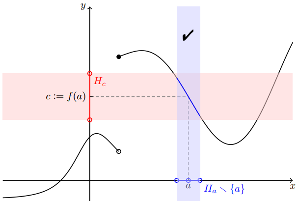
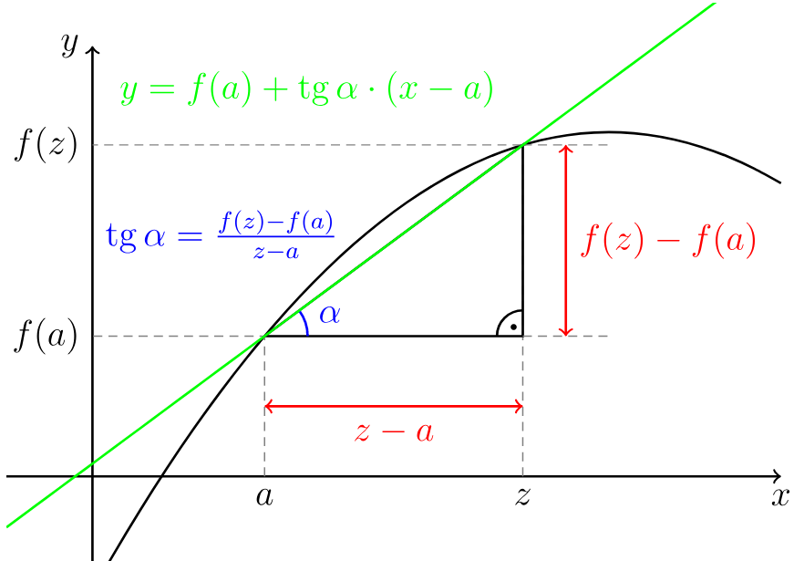
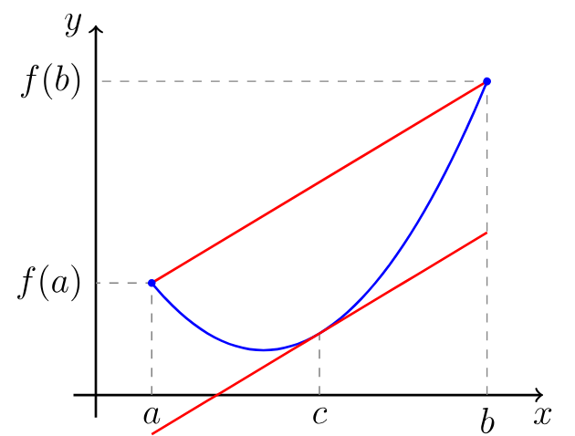
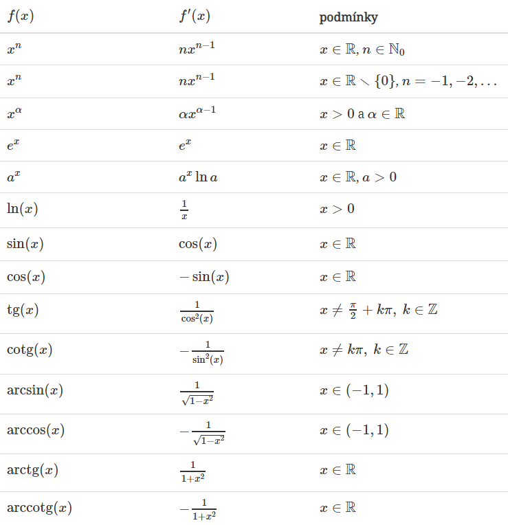

# Limita funkce

## Definice

Buďte $f$ reálná funkce reálné proměnné a
$a \in \overline{\mathbb{R}}\ (\overline{\mathbb{R}}=\mathbb{R}\cup{\pm\infty})$.
Nechť $f$ je definovaná na okolí bodu $a$, s možnou výjimkou bodu a
samotného. Řekneme, že $c \in \overline{\mathbb{R}}$ je limitou funkce
$f$ v bodě $a$, právě když pro každé okolí $H_c$ bodu $c$ existuje okolí
$H_a$ bodu $a$ takové, že z podmínky $x \in H_a \backslash \{a\}$ plyne
$f(x) \in H_c$.

V symbolech:

$(\forall H_c)(\exists H_a)(\forall x \in D_f)(x \in H_a \backslash \{a\} \implies f(x) \in H_c)$.

Tuto skutečnost zapisujeme:

$\lim\limits_{x \rightarrow a} f(x) = c$, $\lim\limits_a f = c$.

## $\epsilon$-$\delta$ definice

$$\big(\forall\epsilon>0\big)\big(\exists\delta>0\big)\big( \forall x \in D_f)( 0 < |x - a| < \delta \ \Rightarrow \ |f(x) - c| < \epsilon\big).$$

## Heineho věta

$\lim\limits_{x \rightarrow a} f(x) = c$, právě když je $f$ definována
na okolí bodu $a$ (s možnou výjimkou bodu $a$) a pro každou posloupnost
$(x_n)_{n=1}^\infty$ s limitou $a$ a splňující

$\{x_n \mid n\in\mathbb{N}\} \subset D_f \backslash \{a\}$

platí $\lim\limits_{x \rightarrow \infty} f(x_n) = c$.

{width=".6\\textwidth"}

## Jednostraná limita

Buďte $f$ reálná funkce reálné proměnné a $a \in \mathbb{R}$. Nechť $f$
je definovaná na levém, resp. pravém, okolí bodu $a$. Řekneme, že
$c\in\overline{\mathbb{R}}$ je limitou funkce $f$ v bodě $a$ zleva,
resp. zprava, právě když pro každé okolí $H_c$ bodu $c$ existuje levé
okolí $H^-_a$, resp. pravé okolí $H^+_a$, bodu $a$ takové, že z podmínky

$x \in H^-_a \ \{a\}, \ \text{resp.} \ x \in H^+_a \ \{a\}$,

plyne

$f(x) \in H_c$.

Zapisujeme

$\lim\limits_{x\to a-} f(x) = c, \text{nebo} \lim\limits_{a-} f = c$,

resp.

$\lim\limits_{x\to a+} f(x) = c, \text{nebo} \lim\limits_{a+} f = c$.

## Heineho věta pro jednostranné limity

$\lim\limits_{x \rightarrow a_-} f(x) = c$, resp.
$\lim\limits_{x \rightarrow a_+} f(x) = c$, právě když je $f$ definována
na levém, resp. pravém, okolí bodu $a$ a pro každou posloupnost
$(x_n)_{n=1}^\infty$ s limitou $a$ a splňující

$\{x_n\, |\, n\in\mathbb{N}\} \subset D_f \cap (-\infty,a), \quad \textrm{resp.} \quad \{x_n\, |\, n\in\mathbb{N}\} \subset D_f \cap (a,+\infty)$,

platí $\lim\limits_{x \rightarrow \infty} f(x_n) = c$.

{width=".6\\textwidth"}

## Vlastnosti

Hodnota limity závisí na okolí bodu, nikoli na samotném bodě. Funkce $f$
v bodě $a$ ani nemusí být definovaná, přesto limita může existovat.
Příkladem je funkce
$f(x)\nolinebreak :=\nolinebreak \text{sgn} \frac{1}{x^2}$,
$D_f = \mathbb{R} \backslash \{0\}$. Ačkoliv $0$ nepatří do $D_f$ platí
$\lim\limits_{x\to 0} f(x) = 1$.

Nechť $a \in \mathbb{R}$. Limita $\lim\limits_{x \rightarrow a} f(x)$
existuje a je rovna c ∈ R, právě když existují obě jednostranné limity
$\lim\limits_{x \rightarrow a_+} f(x)$ a
$\lim\limits_{x \rightarrow a_-} f(x)$ a obě jsou rovny c.

Nechť $f$ a $g$ jsou funkce, $a,b,c \in \overline{\mathbb{R}}$ a platí
tři podmínky

-   $\displaystyle\lim_{x\to a} g(x) = b$,

-   $\displaystyle\lim_{x\to b} f(x) = c$,

-   buď
    $(\exists H_a)(\forall x\in D_g\cap H_a \backslash \{a\})(g(x) \neq b)$
    nebo $(b\in D_f \ \text{a} \ f(b) = c)$.

Potom platí $\displaystyle\lim_{x\to a} f(g(x)) = c$.

Nechť $f$ a $g$ jsou funkce a $a \in \overline{\mathbb{R}}$. Potom
$$\begin{aligned} \lim_a (f + g) &= \lim_a f + \lim_a g, \\ \lim_a f \cdot g &= \lim_a f \cdot \lim_a g, \\ \lim_a \frac{f}{g} &= \frac{\lim_a f}{\lim_a g}, \end{aligned}$$
platí v případě, že výrazy na pravé straně jsou definovány a v posledním
případě za předpokladu, že $\frac{f}{g}$ je definována na okolí bodu $a$
s možnou výjimkou bodu $a$ samotného.

## Důsledek heineho věty

Nechť $f$ je funkce definovaná na okolí bodu a
$a\in\overline{\mathbb{R}}$ a $(x_n)_{n=1}^\infty$ ,
$(z_n)_{n=1}^\infty$ jsou dvě reálné posloupnosti patřící do $D_f$ ,
konvergující k $a$ a splňující podmínky $x_n\neq a$ a $z_n\neq a$ pro
všechna $n\in\mathbb{N}$ . Pokud limity
$\lim\limits_{n\to\infty} f(x_n) \textrm{ a } \lim\limits_{n\to\infty} f(z_n)$
existují a jsou různé, nebo alespoň jedna z nich neexistuje, potom
limita $\lim\limits_{x \rightarrow a} f(x)$ neexistuje.

## Nerovnost

Mějme funkce $f$ a $g$ a nechť existují limity
$\displaystyle\lim_{x\to a} f(x)$ a $\displaystyle\lim_{x\to a} g(x)$.
Pak platí následující dvě tvrzení:

-   Pokud $\displaystyle\lim_{x\to a} f(x) < \lim_{x\to a} g(x)$, potom
    existuje okolí $H_a$ bodu $a$ takové, že pro všechna
    $x\in H_a \backslash\{a\}$ platí $f(x) < g(x)$.

-   Pokud existuje okolí $H_a$ bodu $a$ takové, že pro všechna
    $x\in H_a \backslash\{a\}$ je $f(x) \leq g(x)$, potom
    $\displaystyle \lim_{x\to a} f(x) \leq \lim_{x\to a} g(x)$.

## Limita sevřené funkce

Nechť pro funkce $f$, $g$, $h$ a body $a, c \in \overline{\mathbb{R}}$
platí:

-   existuje okolí $H_a$ bodu $a$ takové, že pro každé
    $x\in H_a\backslash\{a\}$ platí $f(x) \leq g(x) \leq h(x)$

-   existují $\displaystyle\lim_{x\to a}f(x) = \lim_{x\to a}h(x) = c$

Potom existuje i $\displaystyle\lim_{x\to a} g(x)$ a je rovna $c$.

# Derivace funkce

## Definice

Nechť $f$ je funkce definovaná na okolí bodu $a\in\mathbb{R}$. Pokud
existuje limita

$$\lim_{x\to a} \frac{f(x) - f(a)}{x-a}$$

nazveme její hodnotu **derivací funkce** $f$ v bodě $a$ a označíme
$f'(a)$. Pokud je tato limita konečná (tj. $f'(a) \in \mathbb{R}$)
řekneme, že funkce $f$ je diferencovatelná v bodě $a$.

Buď $f$ funkce s definičním oborem $D_f$. Nechť $M$ označuje množinu
všech $a\in D_f$ takových, že existuje konečná derivace $f'(a)$.
Derivací funkce $f$ nazýváme funkci s definičním oborem $M$, která
každému $x \in M$ přiřadí $f'(x)$. Tuto funkci značíme symbolem $f'$.

**Další možná značení:**
$$f'(a), \quad \dot{f}(a), \quad \frac{\mathrm{d}f}{\mathrm{d}x}(a).$$

{width=".6\\textwidth"}

## Tečna

Nechť existuje $f'(a)$. Tečnou funkce $f$ v bodě $a$ nazýváme

-   přímku s rovnicí $x=a$ je-li funkce $f$ spojitá v bodě $a$ a
    $f'(a) = +\infty$ nebo $f'(a) = -\infty$.

-   přímku s rovnicí $y = f(a) +  f'(a) (x-a)$ je-li
    $f'(a) \in\mathbb{R}$ (tj. je-li $f$ diferencovatelná v bodě $a$).

## Operace

### Sčítání, násobení, dělení

Nechť funkce $f$ a $g$ jsou diferencovatelné v bodě $a$. Potom platí:

-   $(f+g)'(a) = f'(a) + g'(a)$

-   $(f\cdot g)'(a) = f'(a) g(a) + f(a) g'(a)$

-   $\displaystyle\left(\frac{f}{g}\right)'(a) = \frac{f'(a)g(a) - f(a)g'(a)}{g(a)^2}$,
    pokud $g(a) \neq 0$

### Složená funkce

Nechť $g$ je funkce diferencovatelná v bodě $a$, $f$ je diferencovatelná
v bodě $g(a)$. Potom funkce $f \circ g$ je diferencovatelná v bodě $a$ a
platí $$(f \circ g)'(a) = f'\big( g(a) \big) \cdot g'(a).$$

### Inverzní funkce

Buďte $f$ spojitá a ryze monotónní na intervalu $I=(a,b)$ a bod
$c \in I$. Má-li inverzní funkce $f^{-1}$ konečnou nenulovou derivaci v
bodě $f(c)$, potom má $f$ derivaci v bodě $c$ a platí
$$f'(c) = \frac{1}{(f^{-1})'(f(c))}.$$

# Průběh funkce

## Spojitost

Nechť $f$ je reálná funkce reálné proměnné a nechť bod $a \in D_f$.
Řekneme, že funkce $f$ **je spojitá v bodě** $a$ jestliže nastává
alespoň jedna z následujících možností:

-   $\displaystyle \lim_{x\to a} f(x) = f(a)$,

-   funkce $f$ je definována jen na pravém okolí bodu $a$, přesněji
    $(\exists H_a)(H_a \cap D_f = H^+_a)$, a
    $\displaystyle \lim_{x\to a+} f(x) = f(a)$,

-   funkce $f$ je definována jen na levém okolí bodu $a$, přesněji
    $(\exists H_a)(H_a \cap D_f = H^-_a)$, a
    $\displaystyle \lim_{x\to a-} f(x) = f(a)$.

Funkce $f$ **je spojitá** v bodě $a$ **zprava**, pokud
$\displaystyle\lim_{x\to a+} f(x) = f(a)$. Funkce $f$ **je spojitá** v
bodě $a$ **zleva**, pokud $\displaystyle\lim_{x\to a-} f(x) = f(a)$.

Funkde $f$ **je spojitá na intervalu $J$**, právě kdyz je spojitá v
každém bodě intervalu **$J$**.

## Extrémy funkce

Řekneme, že funkce $f$ má v bodě $a \in D_f$

1.  lokální maximum

2.  lokální minimum

3.  ostré lokální maximum

4.  ostré lokální minimum

právě když existuje okolí (v krajním bodě jednostranné)
$H_a \subset D_f$ bodu $a$ tak, že

1.  pro všechna $x \in H_a$ platí $f(x) \leq f(a)$,

2.  pro všechna $x \in H_a$ platí $f(x) \geq f(a)$,

3.  pro všechna $x \in H_a \backslash \{a\}$ platí $f(x) < f(a)$,

4.  pro všechna $x \in H_a \backslash \{a\}$ platí $f(x) > f(a)$,

Nechť funkce $f$ má v bodě $a$ lokální extrém. Potom $f'(a)=0$, nebo
derivace v bodě $a$ neexistuje.

Funkce $f$ spojitá a definovaná právě na uzavřeném intervalu
$\langle a,b \rangle$ nabývá maxima a minima (tzv. globální extrém).
Extrém může být pouze v krajních bodech $a,b$ a v bodech kde je derivace
rovna $0$ nebo neexistuje.

## Věty o přírustku funkce

### Rolleova

Nechť funkce $f$ splňuje podmínky

1.  $f$ je spojitá na intervalu $\langle a,b \rangle$,

2.  $f$ má derivaci v každém bodě intervalu $(a,b)$,

3.  $f$ $(a)=f(b)$.

Potom existuje $c\in(a,b)$ tak, že $f'(c)=0$.

{width=".6\\textwidth"}

### Lagrangeova

Nechť funkce $f$ splňuje podmínky

1.  $f$ je spojitá na intervalu $\langle a,b \rangle$,

2.  $f$ má derivaci v každém bodě intervalu $(a,b)$,

Potom existuje bod $c \in (a,b)$ tak, že
$\displaystyle f'(c) = \frac{f(b) - f(a)}{b-a}$, nebo ekvivalentně
$f(b) - f(a) = f'(c) (b-a)$.

{width=".4\\textwidth"}

## Důsledky

Nechť $J$ je interval s krajními body $a$ a $b$. Potom vnitřkem
intervalu $J$ nazveme otevřený interval $(a,b)$. Značíme ho
$J^\circ=(a,b)$.

### Rostoucí, klesající, konstantní

Nechť $f$ je spojitá na intervalu $J$ a nechť pro každé $x\in J^\circ$
existuje $f'(x)$. Potom platí následujících pět tvrzení:

1.  $\big(\forall x\in J^\circ\big)\big(f'(x) \geq 0\big) \implies f$ je
    rostoucí na $J$,

2.  $\big(\forall x\in J^\circ\big)\big(f'(x) \leq 0\big) \implies f$ je
    klesající na $J$,

3.  $\big(\forall x\in J^\circ\big)\big(f'(x) > 0\big) \implies f$ je
    ostře rostoucí na $J$,

4.  $\big(\forall x\in J^\circ\big)\big(f'(x) < 0\big) \implies f$ je
    ste klesající na $J$,

5.  $\big(\forall x\in J^\circ\big)\big(f'(x) = 0\big) \implies f$ je
    konstantní na $J$.

### Konvexní, konkávní

Funkci $f$ definovanou na intervalu $J$ nazveme **konvexní na
intervalu** (resp. **konkávní na intervalu**) $J$, právě když pro každé
$x_1,x_2,x_3 \in J$ splňující $x_1<x_2<x_3$, leží bod $(x_2,f(x_2))$
buďto pod (resp. nad) přímkou spojující body $(x_1,f(x_1))$ a
$(x_3,f(x_3))$, nebo na ní.

Funkci $f$ definovanou na intervalu $J$ nazveme **ryze konvexní na
intervalu** (resp. **ryze konkávní na intervalu**) $J$, právě když pro
každé $x_1,x_2,x_3 \in J$ splňující $x_1<x_2<x_3$, leží bod
$(x_2,f(x_2))$ buďto pod (resp. nad) přímkou spojující body
$(x_1,f(x_1))$ a $(x_3,f(x_3))$.

Buď $f$ funkce spojitá na intervalu $J$, která má druhou derivaci v
každém bodě intervalu $J^\circ$.

-   Funkce $f$ je konvexní na intervalu $J$, právě když $f''(x)\geq0$pro
    každé $x\in J^\circ$.

-   Je-li $f''(x)>0$ v každém bodě $x\in J^\circ$, pak je $f$ ryze
    konvexní na $J$.

Nechť funkce $f$ má konečnou derivaci v bodě $a\in D_f$. Pokud existuje
okolí $H_a$ bodu a takové, že pro všechna $x\in H_a \backslash {a}$ leží
všechny body $(x,f(x))$ nad (resp. pod) tečnou funkce $f$ v bodě $a$,
$$y = f(a) + f'(a) (x-a),$$ nebo na ní, pak $f$ nazveme konvexní v bodě
$a$ (resp. konkávní v bodě $a$).

### Lokální minimum a maximum

Buď $f$ funkce diferencovatelná v každém bodě intervalu $J$ a nechť
$f'(c)=0$ pro jisté $c\in J^\circ$.

-   Pokud je $f$ konvexní na intervalu $J$, pak má funkce $f$ v bodě $c$
    **lokální minimum**.

-   Pokud je $f$ konkávní na intervalu $J$, pak má funkce $f$ v bodě $c$
    **lokální maximum**.

### Inflexní bod

Nechť $f$ je spojitá v bodě $c$. Bod $c$ nazýváme inflexním bodem funkce
$f$, právě když existuje $\delta>0$ takové, že $f$ je ryze konvexní na
intervalu ($c-\delta,c)$ a ryze konkávní na intervalu $(c,c+\delta)$,
nebo naopak.

### Asymptoty

Řekneme, že funkce $f$ má v bodě $a \in \mathbb{R}$ asymptotu $x=a$,
právě když $\displaystyle\lim_{x\to a+} f(x)$ nebo
$\displaystyle\lim_{x\to a-} f(x)$ je rovna $+\infty$ nebo $-\infty$.
Řekneme, že přímka $y=kx+q$ je asymptotou funkce $f$ v $+\infty$, resp.
v $-\infty$, když
$$\lim_{x\to\infty} \big( f(x) - kx - q \big) = 0 \ \text{resp.} \ \lim_{x\to-\infty} \big( f(x) - kx-q \big) = 0.$$

{width=".7\\textwidth"}

# Tabulky

{width="\\textwidth"}
