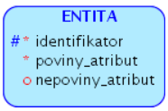
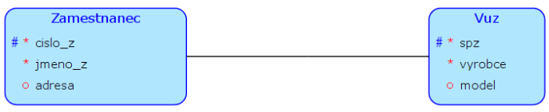
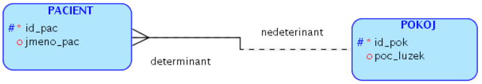
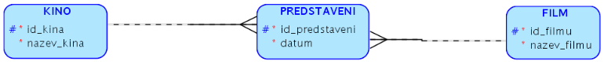
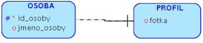

# Popis

Algoritmus na transformaci (převod) konceptuálního schématu na relační
bývá součástí modelovacích nástrojů (oracle, EA..). Některé konstrukce
mohou mít několik variant převedení (několik různých).

# Postup transformace

Jediná možnost provázání dat ze dvou relací je referenční integritou
(FOREIGN KEY).

-   název entity $\rightarrow$ název relace

-   atribut entity $\rightarrow$ atribut relace

-   povinnost atributu entity $\rightarrow$ NOT NULL

-   atributy edentifikátoru entity $\rightarrow$ PRIMARY KEY

-   alternativní klíče $\rightarrow$ UNIQUE

-   u slabých entit $\rightarrow$ identifikátor vlasníka

## Transformace silné entity

Daná entita se převede na tabulku s hodnotami
**entita([identifikator]{.ul}, povinny_atribut, nepovinny_atribut)**.
Podtržení znamená, že je to primární klíč.

{width="25%"}

## Vztah 1:1, obě části jsou ve vztahu povinné

Dojde k sjednocení daných entit do jedné tabulky
**zamestnanec_vuz([cislo_z]{.ul}, jmneo_z, adresa, spz, vyrobce,
model)**. Kde navíc **spz je NOT NULL a UNIQUE** (protože byl
identifikátorem).

{width="50%"}

## Vztah 1:1, kde jen jedna část je povinná

Entity se nemohou spojit kvůli nepovinnosti jedné strany. Převedou se
tedy na dvě tabulky, kde tabulka, jež je nepovinnou částí, bude mít ID
odkaz na povinnou část.

{width="50%"}

-   zamestnanec([cislo_z]{.ul}, jmeno_z, adresa)

-   vuz([spz]{.ul}, vyrobce, model, `cislo_z`) a [cislo_z]{.ul} je NOT
    NULL UNIQUE (kvůli zachování vazby 1:1)

-   vuz\[cislo_z\] $\subseteq$ zamestnanec\[cislo_z\]

## Vztah 1:1, obě nepovinné

{width="50%"}

Lze vyřešit dvěmi způsoby. **První řešení** odpovídá předchozímu
případu, akorát **cislo_z** v tabulce vuz bude **nepovinný**.

Druhé řešení přidává relační tabulky:

-   zamestnanec([cislo_z]{.ul}, jmeno_z, adresa)

-   vuz([spz]{.ul}, vyrobce, model)

-   zamestnanec_vuz([cislo_z]{.ul}, spz), kde SPZ je NOT NULL a UNIQUE

-   zamestnanec_vuz\[spz\] $\subseteq$ vuz\[spz\]

-   zamestnanec_vuz\[cislo_z\] $\subseteq$ zamestnanec\[cislo_z\]

## Vztah 1:N, povinná účást stany N (determinant)

{width="60%"}

-   pacient([id_pac]{.ul}, jmeno_pac, id_pok)

-   pokoj([id_pok]{.ul}, poc_luzek)

-   pacient\[id_pok\] $\subseteq$ pokoj\[id_pok\], kde id_pok je NOT
    NULL

## Vztah 1:N, nepovinná účást stany N (determinant)

Opět dva způsoby jak se dá řešit, první je vzít řešení z předchozí
ukázky a nastavit **[id_pok]{.ul} na nepovinný**. A druhé řešení je opět
vytvoření vazební tabulky

{width="60%"}

-   pacient([id_pac]{.ul}, jmeno_pac),

-   pokoj([id_pok]{.ul}, poc_luzek)

-   umisteni([id_pac]{.ul}, id_pok), kde id_pok je NOT NULL

-   umisteni\[id_pac\] $\subseteq$ pacient\[id_pac\]

-   umisteni\[id_pok\] $\subseteq$ pokoj\[id_pok\]

## Vztah M:N

{width="60%"}

-   kino([id_kina]{.ul}, nazev_kina),

-   film([id_filmu]{.ul}, nazev_filmu)

-   predstaveni([id_kina, id_filmu]{.ul})

-   predstaveni\[id_kina\] $\subseteq$ kino\[id_kina\]

-   predstaveni\[id_filmu\] $\subseteq$ film\[id_filmu\]

Toto řešení způsobuje to, že v jendom kině se může hrát film pouze
jednou. Tento problém se řeší pomocí dekompozice.

## Dekompozice vztahu M:N

{width="80%"}

-   kino([id_kina]{.ul}, nazev_kina),

-   film([id_filmu]{.ul}, nazev_filmu)

-   predstaveni([id_predstaveni]{.ul}, datum, id_kina, id_filmu), ID
    kina a filmu jsou NOT NULL

-   predstaveni\[id_kina\] $\subseteq$ kino\[id_kina\]

-   predstaveni\[id_filmu\] $\subseteq$ film\[id_filmu\]

## Slabá entita

Vezmeme v příklad čísla bloků a v jednotlivých blocích jsou pokoje.
Bloky jsou číslované 1, 2,...,n a v každém bloku jsou číslované pokoje
od 1 do n. Pomocí samotného čísla pokoje se nedá identifikovat, kde se
nachází, protože každý blok má pokoje stejně číslován. Ale pomocí
kombinace číslo bloku + číslo pokoje jsmě již schopní pokoj najít.

{width="40%"}

-   blok([id_bloku]{.ul}, nazev_bloku),

-   pokoj([id_pokoje, id_bloku]{.ul})

-   pokoj\[id_bloku\] $\subseteq$ blok\[id_bloku\]

## Identifikační závislost

{width="40%"}

Každý uživatel má pouze jeden profil a ten profil patří pouze jednomu
uživateli. Uživatel nemusí mít profil, ale pokud ho má, tak je jasně
identifikován pomocí uživatele.

-   osoba([id_osoby, jmeno_osoby]{.ul})

-   profil([id_osoby]{.ul}, fotka)

-   profil\[id_osoby\] $\subseteq$ osoba\[id_osoby\]

# ISA hierarchie

Jedná se o způsob jak vyřešit více vztahů při převodu. Rozdělují se na
tři typy:

-   všechny vazby do jedné tabulky

-   polymorfismus

-   více oddělených tabulek

Příklad:

{width="70%"}

-   vše dohromady

    -   osoba([id_osoby]{.ul}, email, telefon, jmneo, ico, dic)

-   polymorfismus

    -   osoba(id_osoby, email, telefon), kde ID osoby je UNIQUE

    -   fyzicka([id_osoby]{.ul}, jmneo)

    -   pravnicka([id_osoby]{.ul}, ico, dic)

    -   fyzicka\[id_osoby\] $\subseteq$ osoba\[id_osoby\]

    -   pravnicka\[id_osoby\] $\subseteq$ osoba\[id_osoby\]

-   oddělené tabulky

    -   fyzicka([id_osoby]{.ul}, email, telefon, jmneo)

    -   pravnicka([id_osoby]{.ul}, email, telefon, ico, dic)
