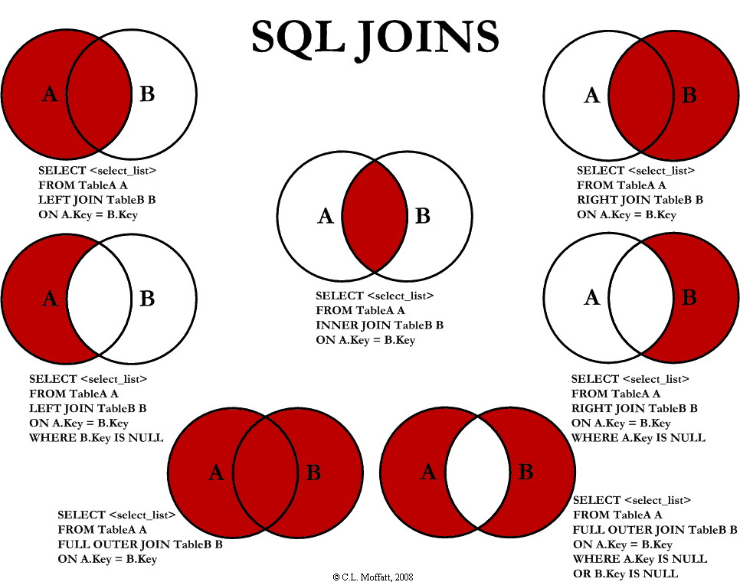

# Agregace

Výpočet napříč skupinou zdrojových řádků. Syntax:

-   agregační_funkce([ALL]{.ul}\|DISTINCT sloupec \| vyraz)

    -   COUNT, SUM, MAX, MIN, AVG...

    -   COUNT($\oslash$) = 0

{width="0.8 \\textwidth"}

Pořadí vyhodnocení:

-   zdroj - from

-   selekce - where

-   seskupení - group by

-   agregační funkce

-   selekce na výsledky agregační funkce - having

-   řazení výsledků - order by

# Vnořené dotazy

Dělí se na vztažné a nevztažné.

-   vztažné - použivají referenci na nadřazený dotazování (většinou
    časově náročnější)

-   nevztažné - jedná se o nezávislý poddotaz, který nemá vztah s
    nadřazeným

# Pohledy - view

-   pohled je virtuální relace

-   je uložen ve formě SELECT příkazu

-   z hlediska dotazování zaměnitelný s tabulkou

-   nepřinášejí výkonové zrychlení - k tomu lze použít Materialized
    views

# Vnější spojení

Vnější spojení (outer join) - normální spojení (inner join) +
lefá/pravá/obě (left/right/join). Chybějící sloupce jsou doplněny
hodnotou NULL. anti-join - redukce n-tic relace za ty, které nejsou
spojitelné s žádnou n-ticí druhé relace

{width="1 \\textwidth"}

# Kvantifikátory

Existenční (exists / not exists) vs všeobecný (není přímo implementován)
Exists:

-   nezáleží na tom, co se vybere ve vnořeném selectu

{width="0.6 \\textwidth"}

{width="0.6 \\textwidth"}

-   unique při vrácení prázdné množiny vrací true

-   exists vrací false
