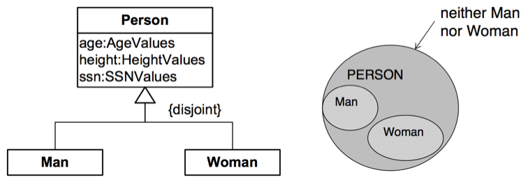

# OntoUML

OntoUML je jedním z možných nástrojů konceptuálního modelování pro
popisování reálného světa. Narozdíl od UML nepopisuje třídy a objekty z
programátorského hlediska, místo toho definuje objekty podle jejich
vlastností a stavů.

Součástí OntoUML je Unified Foundational Ontology (UFO), ta se dělá na
tři části:

1.  **UFO-A**: strukturální aspekty reality - objekty, jejich typy,
    podčásti a role (v OntoUML se jedná o sortály)

2.  **UFO-B**: dynamické aspekty - události, jejich části a vazby mezi
    nimi (non-sortály)

3.  **UFO-C**: sociální aspekty - cíle, vztahy, stavy

Používá modální logiku (rozšíření predikátové logiky):

-   existenční kvantifikátor

-   univerzální kvantifikátor

-   nutnost - ve všech světech platí

-   možnost - v některém světě platí

Postup modelování:

1.  Vytvoření slovníku pojmů.

2.  Vytváření ontologie na základě ontologických vzorů.

3.  Validace konceptuálního modelu se zadavatelem.

# Konstrukty

-   **Třída** - vychází z koncepce UML, popisuje vlastnosti sdílené mezi
    určitými entitami - **instance třídy**.

-   **Atribut** - reprezentuje vlastnosti sdílené instancemi třídy.

## Dědění

Dědění - Třídy sdílející společný nadtyp mohou být sdruženy v tzv.
množině nadtypu (Generalization Set). Lze upřesnit na:

-   **Complete** - Podtřídy pokrývají všechny možné instance přímé
    nadtřídy.\
    ()

    {width="7.5cm"}

-   **Disjoint** - všechny podmnožiny zapojené v generalizaci jsou
    vzájemně disjunktní\
    ()

    {width="7.5cm"}

-   **Complete a Disjoint** (Partition) - každá instance nadtřídy je
    instance právě jedné podtřídy.\
    ()

## Typy objektů

-   **Sortal**

    -   **Rigid**

        -   **Kind** - poskytuje identitu

        -   **SubKind**

    -   **Anti-rigid**

        -   **Phase**

        -   **Role**

-   **Non-sortal**

    -   **Rigid**

        -   **Category** - nutné vlastnosti více Kinds.

    -   **Non-rigid**

        -   **Mixin** - vlastnosti více Kinds, které jsou nutné pro
            některé instance a možné pro jiné.

        -   **RoleMixin** - možné a relační vlastnosti sdílené entitami
            vícero typů.

{width="80%"}

## Sortal

-   **Sortal** - poskytuje identitu

-   **Non-sortal** - z hlediska našeho vnímání nemá vlastní identitu

## Rigidity

-   **Rigid** - Typ je rigidní pro každou instanci $x$ právě tehdy, když
    $x$ je nutně (v modálním slova smyslu) instancí $T$. *Platí ve všech
    světech. Nemění se v čase.*\
    $$R_+(T) \vcentcolon= \square(\forall x~T(x) \Rightarrow \square(T(x)))$$

-   **Anti-rigid** - Typ $T$ je anti-rigidní pro každou instanci $x$,
    právě tehdy když je možné (v modálním slova smyslu), že $x$ nemusí
    být instancí $T$. *Platí v nějakém světě.*\
    $$R_-(T) \vcentcolon= \square(\forall x~T(x) \Rightarrow \Diamond(\neg T(x)))$$

-   **Non-rigid** - logická negace rigidity.
    $$NR(T) \vcentcolon= \Diamond(\exists x~T(x) \Rightarrow \Diamond(\neg T(x)))$$

## Celek-část

-   **Povinná část** - Celek má alespoň jednu část

-   **Esenciální část** - Instanci části nelze měnit

-   **Nepovinný celek** - Část nepotřebuje celek

-   **Povinný celek** - Část vyžaduje celek

-   **Neoddělitelná část** - Instanci celku nelze měnit

-   **Neměnitelná část** - Část nelze měnit, celek není rigidní

-   **Neměnitelný celek** - Celek nelze měnit, část není rigidní

```{=html}
<!-- -->
```
-   **Quantity** - typicky materiály (např. písek, víno, dřevo, ...);
    esenciální, tranzitivní, reflexivní

    -   **SubQuantityOf**: alkohol-víno

-   **Collective** -

    -   **MemberOf**: strom-les, student-paralelka

    -   **SubCollectionOf**: studenti s vyznamenáním-studenti

-   **Functional Whole**

    -   **ComponentOf**: srdce-oběhový systém, ředitel-firma

# Transformace do objektového modelu

Transformace OntoUML do objektoveho modelu () pomocí:

-   objektů (tříd) s atributy a metodami

-   skládání objektů

-   dědění mezi třídami

1.  Entity $\to$ Třídy (kind, subkind, role, ...)

2.  Complete - Abstraktní třída

3.  Zajištění povinnosti 1\...:

    -   hard metoda (vynutíme v konstruktoru),

    -   soft metoda (kontrolujeme konzistenci v programu).

4.  Vztah 0\...1 -- instanční proměnné

5.  Vztah 0\...\* -- kolekce

6.  **Complete** -- nadtřída implementována jako abstraktní.

7.  **Disjoint** -- standardní chovaní s jednoduchou dědičností.

8.  **Non-disjoint** - implementace děděním (exponenciální počet tříd)
    nebo skládáním.

9.  **Sortal** -- v implementaci jednoznačný identifikátor, který v
    reálném světě neexistuje.

10. **Role** -- implementace jako třída, příslušnost role skládáním.

11. **Phase** -- implementována návrhovým vzorem State.

12. **Non-sortal** -- slouží jako další dimenze kategorizace. Zpravidla
    vytváří problém s vícenásobnou dědičností / skládání.
