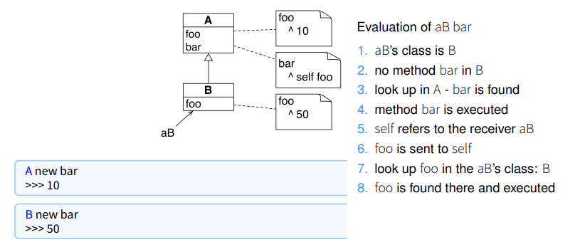
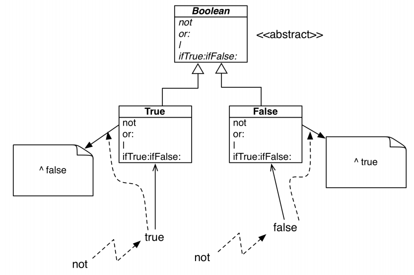

# Postup návrhu OO systémů

1.  Identify minimal requirements

2.  Make requirements testable

3.  Identify objects and their responsibilities

4.  Implement and test classes

5.  Refactor to simplify design

6.  Iterate

# Povinosti objektů

-   uchovávat informace a poskytovat služby pracující s těmito
    informacemi

-   **high cohesion** -- vysoká soudružnost operací a dat uvnitř třídy

-   **low coupling** -- nízká provázanost mezi třídami (*Každá třída by
    měla provádět právě jednu činnost*)

-   **high-level-of-abstraction** -- vysoká míra abstrakce. Na všechno
    mít speciální rozhraní a vždy používat rozhraní místo implementace.

# Symptomy degradujícího návrhu SW

-   **Rigidity** -- SW není snadné jednoduše měnit nebo rozšiřovat,
    nelze přidávat ani jednoduché funkcionality.

-   **Fragility** -- Změna jedné části SW ovlivní (rozbije) jinou část
    SW (třeba i konceptuálně odlišnou).

-   **Immobility** -- Není možné znovu použít SW pro jiné projekty nebo
    alespoň pro části jiných projektů.

-   **High design viscosity** -- Udržování správného návrhu je
    implementačně náročnější než to udělat proti pravidlům daného
    návrhu, což vede k degradaci návrhu.

-   **High environment viscosity** -- Prostředí pro vývoj SW je pomalé a
    neefektivní. Například dlouhý *compile-time*.

# Principy OO návrhu

Dodržování následujících principů vede ke snížení provázanosti mezi
třídami. V přednáškách bylo zmíněných pět principů zaměřených na návrh
tříd. Ostatní principy se týkají rozdělení tříd do balíčků. Všechny
principy OO návrhu lze najít na:

**http://www.butunclebob.com/ArticleS.UncleBob.PrinciplesOfOod**

-   **SRP -- single responsibility principle** *A class should have one,
    and only one, reason to change.*

    Každá třída, modul nebo metoda má mít pouze jednu povinnost, jeden
    účel. Tato povinnost by měla být kompletně zapouzdřena touto třídou,
    modulem, metodou.

-   **OCP -- open-closed principle**

    *You should be able to extend a classes behavior, without modifying
    it.*

    SW entity by měly být snadno rozšiřitelné, ale nesmí být možnost
    měnit jejich chování.

-   **LSP -- Liskov substitution principle**

    *Derived classes must be substitutable for their base classes.*

    Odvozené třídy musejí být použitelné přes rozhraní jejich nadřazené
    třídy. Uživatel zvenku nezmí poznat rozdíl mezi *derived class* a
    *base class*.

-   **ISP -- interface segregation principle**

    *Make fine grained interfaces that are client specific.*

    Více detailních rozhraní je lepší než jedno obsáhlé rozhraní
    (*general purpose*). Každá třída musí implementovat pouze takové
    metody, které skutečně používá a potřebuje. Nikdy se nesmí stát, že
    by třída musela kvůli svému rozhraní implementovat něco, co
    nepotřebuje.

    {width="100%"}

-   **DIP -- dependency inversion principle**

    *Depend on abstractions, not on concretions.*

    Abstrakce by neměla záviset na detailech. Detaily by měly záviset na
    abstrakci.

    {width="100%"}

# Závěr k principům OO návrhu

Malé shrnutí z přednášky o principech OO návrhu:

-   *podstata je v zasílání zpráv objektům, což vytváří očekávání na
    polymorfismu*,

-   *volající objekt neví, které konkrétní chování zprávou vyvolá, a ani
    ho to nezajímá, komunikuje s rozhraním volaných objektů, nikoliv s
    jejich implementací*,

-   provázanost mezi třídami je špatná a vede k *rigid*, *fragile*,
    *non-reusable* SW,

-   zamezení vysoké provázanosti lze dosáhnout pomocí dodržování SRP,
    OCP, LSP, ISP a DIP.

# Podotázky k této státnicové otázce na moodlu BI-OOP

**https://moodle.fit.cvut.cz/mod/url/view.php?id=67753**

-   *How encapsulation and composition work together*

    **Zapouzdření** -- skrytí a kontrola vnitřního stavu objektu.
    Klientské objekty nemají přístup k vnitřnímu stavu.

    **Kompozice** -- objekt může být sestaven z několika komponent
    (jiných objektů) na které může **delegovat** podproblémy při řešení
    jeho povinností. Jednotlivé komponenty objektu by neměly být
    přístupné klientským objektů, které ho využívají. Toho lze docílit
    pomocí zapouzdření. Objekt **O** vlastnící komponentu **C** by měl
    mít možnost úplné výměny komponenty **C**, aniž by ovlivnil
    jakýkoliv klientský objekt, který s objektem **O** pracuje.

-   *Explain 'self' and 'super'.*

    **self** -- reprezentuje příjemce zprávy. **Method-lookup** (kde se
    začíná hledat odpovídající metoda pro příchozí zprávu) začíná v
    příjemci.

    {width="100%"}

    **super** -- reprezentuje příjemce zprávy (úplně stejně jako
    **self**). **Method-lookup** začíná v **superclass** (hierarchicky
    nadřazená třída) výrazu, který obsahuje **super**.

    {width="100%"}

-   *Why can we say that sending a message is making a choice?*

    Volba prováděné metody odpovídající zasílané zprávě je závislá na
    příjemci (konkrétní instanci třídy). S každým zasláním zprávy tedy
    *vybíráme* metodu podle aktuálního příjemce. To odpovídá *if, then,
    else* rozhodování, jehož větve se ale vytváří až za běhu programu.

-   *How 'not' is implemented? What the implementation illustrates?*

    **Boolean** je implementován jako abstraktní třída. Od **Boolean**
    dědí třídy **True** a **False**. Tyto třídy implementují metody
    **not**, která pouze vrací instanci toho opačného booleanu. Třídy
    **True** a **False** mají singleton instance **true** a **false**.

    {width="100%"}

-   *Why is testing important?*

    -   Specifikace očekávaného chování a výsledků (v jistém smyslu
        slouží i jako dokumentace).

    -   Nalezení problémů a porozumění kódu.

    -   Zvýšení důvěry v kód.

    -   Odhalení bugů, které se projeví změnou jené části kódu.

    -   Izolování problému.

    -   *Další nápady na tuto velice obecnou otázku viz BI-SI1, BI-SI2.*

    Testy by měly:

    -   ověřit mezní hodnoty,

    -   ověřit komplexní scénáře,

    -   mít dobré pokrytí,

    -   ověřit abstrakci problémů,

    -   být nezávislé.

-   *Object initialization practices*

    **Provider responsibility** -- je povinností každé třídy aby
    poskytovala *well-formed* instance, tedy takové instance, které
    nevyžadují žádné další zasílání zpráv pro svoji inicializaci. K tomu
    je důležitá **automatická inicializace** instančních proměnných a
    vnitřního stavu obecně, například pomocí poskytntí výchozích
    (*default*) hodnot.

    **Lazy initialization** -- pozdržení inicializace hodnoty do doby,
    kdy je hodnotu poprvé potřeba použít. Vhodné použít v případě, že
    nejsou instanční proměnné používané pořád a zabírají spoustu místa
    nebo závisejí na jiných komponentách.

    **Zakázání výchozího konstruktoru** -- pokud k vytvoření třídy vždy
    potřeba nějaký parametr, je třeba zabránit vytvoření instance pomocí
    výchozího konstruktoru, například pomocí vyhození výjimky ve vlastní
    implementaci výchozího konstruktoru.

-   *Why self-sends are plans for reuse?*

    Používání odkazování na příjemce pomocí **self** v metodách
    zachovává informaci o třídě instance příjemce. To vede k většímu
    znovupoužití kódu (měníme pouze malé metody v podtřídách a hlavní
    metoda nadtřídy může zůstat jednoduchá).

    ``` {.smalltalk breaklines=""}
          ClassA>>doStuff
          ^ self getNum

          ClassA>>getNum
          ^ 10

          ClassB>>getNum
          ^ 20

          ClassB new doStuff.   " >>>> 20 "
    ```
