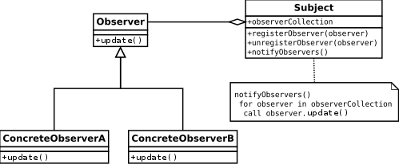
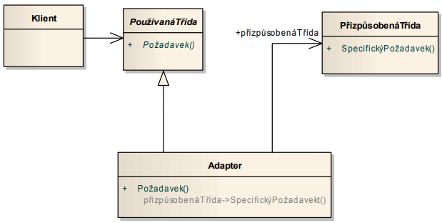

---
author:
- Jakub Rathouský
subject: SI1.2
---

# Třívrstvá architektura

Vhodná pro složitější (enterprise) aplikace, vrstvy:

-   Prezentační

-   Business (doménová)

-   Datová (technické služby)

Rozděluje se na dva typy:

-   striktní - závislost vždy směrem dolů a pouze o jednu úroveň

-   relaxovaná - závislost vždy směrem dolů, přes libovolný počet
    úrovní, nejvíce používaná

## Prezentační vrstva

-   obsahuje HTML stránky, šablony, třídy pro zpracování požadavků
    uživatelů, navigace mezi stránkami...

-   poskytují GUI, API

-   problém závislosti zdola nahoru

## Business vsrtva

-   business logika

-   procesy a validace

-   nezávislá na prezentační vrstvě a datové vrstvě

## Datová vrstva

-   persistence dat

## Výhoda třívrstvé architektury

-   oddělení business logiky od prezentační vrstvy

-   nezávislost business logiky na způsobu uložení

-   snadná výměna jednotlivých vrstev

-   jednoduché testování

-   více různých prezentačních vrstev

-   znovu použitelnost

    -   čím nižší vrstva tím víc je možné jí znovu použít (logování,
        persistence, odesílání emailů...)

    -   čím vyšší vrstva, tím je specifičtější pro konkrétní projekt

# Model View Controller (MVC)

Vzor řešící problém prezentační vrstvy. Založený na oddělení logiky od
GUI. Třívrstvá architektura.

-   model

-   view

-   controller - zpracovává uživatelský vstup

Rozděluje se na dva typy modelu:

-   aktivní - upozorňuje na změny, které nastaly

-   pasivní - pouze reaguje na požadavky

Jedná se velmi často o součást existujících řešení:

-   Spring MVC

-   Swing

-   React, Angular

-   ...

## Model View Presenter (MVP)

Podobná verze MVC. Událost odchytí View, ale zpracování deleguje na
Presenter. GUI založené na komponentách.

-   model

-   view - zpracovává uživatelský vstup

-   presenter

# GoF (Gang of Four) vzory

Rozdělení:

-   vzory pro vytváření objektů (creational)

    -   abstraktní továrna (abstract factory)

    -   stavitel (builder)

-   strukturální vzory (structural)

    -   adaptér (adapter)

-   vzory chování (behavioral)

    -   stav (state)

    -   pozorovatel (observer)

## Abstraktní továrna (Abstract factory)

-   poskytuje rozhraní pro vytváření skupiny objektů bez znalosti
    konkrétní implementace

-   konkrétní implementace je dána použitou továrnou

{width="95%"}

## Stavitel (Builder)

-   director - řídí strukturu výsledného produktu

-   builder

    -   umít postavit jednotlivé části produktu v konkrétní technologii

    -   je řízen Directorem

{width="95%"}

## Stav (State)

-   odděluje chování třídy závislé na stavu do samostatné třídy

-   odstraňuje složité větvení (switch, case, if, else)

-   libovolný počet stavů

-   snadné přidání nového stavu

{width="95%"}

## Pozorovatel (Observer)

-   pozorující objekty se zaregistrují u pozorovaného objektu

-   pozorující objekt musí implementovat požadované rozhraní

-   při změně upozorní pozorovaný objekt všechny pozorující pomocí
    tohoto rozhraní

{width="95%"}

## Adaptér (Adapter)

-   konvertuje rozhraní jedné třídy na rozhraní jiné

-   umožňuje propojit třídy s ruzným rozhraním

{width="95%"}
