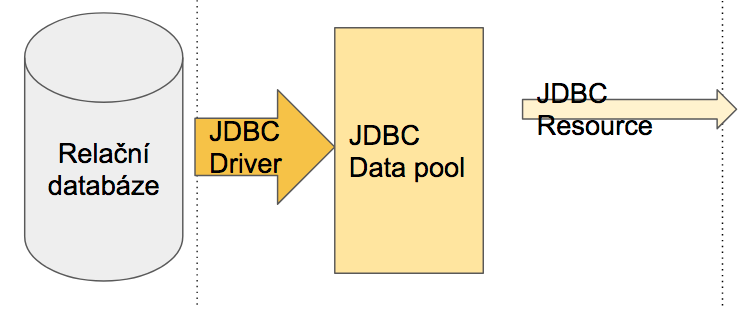

# JDBC Java Database Connectivity

-   Java rozhraní pro připojení k relační databázi

-   Součástí přímo Java SE už od verze 1.1

-   Umožňuje vytvořit takzvané spojení (connection) s databází

-   Přes toto spojení lze pak spouštět dotazy SELECT, CREATE, INSERT,
    UPDATE a DELETE.

-   JDBC je pouze obecné rozhraní. Pro připojení ke konkrétnímu typu
    databáze (MySQL, PostgreSQL\....) je potřeba takzvaný driver.

-   JDBC Driver realizuje spojení s konkrétní databází → implementuje
    JDBC interface

{width="95%"}

# Připojení se k DB

Nejdříve se k databázi připojíme (pozn.: try-with-resources funguje od
Javy 7) pomocí třídy `DriverManager`{.java}. Před Javou 6 bylo třeba
explicitně definovat třídu driveru a načíst ji.

```java
try (Connection conn = DriverManager.getConnection(
     "jdbc:mysql://localhost/mydb",
     "myLogin",
     "myPassword")) {

  // zde používáme vytvořené spojení

}  // Java VM se postará o uzavření spojení
```

Využití DriverManageru je vcelku nepraktické (musíme být v try bloku), a
proto vznikl DataSource. Jedná se o interface, která vrací stejnou
Connection jako DriverManager. Vývojáři DB musí poskytovat konkrétní
implementaci DataSource. Connection lze získat bez parametrů nebo s
pomocí dvojice .

```java
com.dbaccess.BasicDataSource ds = new com.dbaccess.BasicDataSource();
ds.setServerName("mujserver");
ds.setDatabaseName("mojedatabaze");

// Metoda odstinena od konkretniho driveru → polymorfismus
public void doThings(DataSource ds) {
  Connection con = ds.getConnection("user", "psswd");
}
```

Detaily připojení tak nemusí být napevno v aplikaci. DriverManager dále
nabízí connection pooling (viz níže).

# Práce s DB

Příkazy se vykonávají pomocí třídy Statement.

```java
try (Statement stmt = conn.createStatement()) {
  stmt.executeUpdate("INSERT INTO table VALUES ('neco')");
}
```

Existuje pak i PreparedStatement, do kterého lze dodávat argumenty
dynamicky.

```java
try (PreparedStatement ps = conn.prepareStatement(
     "SELECT * FROM person WHERE name = ? AND age = ?")
) {
    ps.setString(1, "Poor Yorick");
    ps.setInt(2, 90);
}
```

Návratová hodnota je `ResultSet`{.java}. Je to takový převlečený
návrhový vzor `Cursor ~ Iterator`{.java}. Můžeme s pomocí něj iterovat
přes řádky výsledků a podle indexů sloupce si sahat na jednotlivé
hodnoty.

```java
try (Statement stmt = conn.createStatement();
     ResultSet rs = stmt.executeQuery("SELECT * FROM person")
) {
  while(rs.next()) {
    String personName = rs.getString(1); // index sloupce
    int personAge     = rs.getInt(2);
  System.out.printf("Osoba: %s (%d)\n", personName, personAge);
  }
}
```

Dále lze pomocí příznaků specifikovat, jestli iterace může být pouze
jednosměrná nebo oboustranná.

Jeden příkaz znamená jeden atomický dotaz do databáze. V rámci jedné
transakce lze ale vykonat více příkazů. Ovlivňuje to metoda
`Connection#setAutoCommit(boolean)`{.java}. Pokud nastavíme autocommit
na false, tak je potřeba transakci ručně odeslat -
`Connection#commit()`{.java}.

{width="95%"}

# JDBC Connection pooling

Problém - pro každé vykonání dotazu je třeba se k databázi připojit.
Připojení stojí nějaký čas a není dobré se neustále připojovat a
odpojovat. Connection pooling zajišťuje, že připojení proběhne na
začátku a zachová se i po vykonání dotazu. Pro další dotaz je existující
připojení znovupoužito.

Connection pooling probíhá v Javě automaticky, pokud je využit
`DataSource`{.java}. Podpora musí být na straně implementace této
`interface`{.java}. JDBC 3.0 API Framework specifikuje sadu rozhraní,
které musí být implementovány.

-   `ConnectionPoolDataSource`{.java} - implementace od autorů databází
    slouží jako factory, která vytváří PooledConnection

-   `PooledConnection`{.java} - řídí připojení k databázi

-   `ConnectionEventListener`{.java} - listener změn v připojeních k DB

Nastavení Connection poolu se v TJV dělalo přes Glassfish. Na localhost
webu se zadaly přihlašovací údaje do databáze, adresa databáze atp.

Jak na to - viz video
[https://youtu.be/f1z-3zlkXj8?t=2m27s ](https://youtu.be/f1z-3zlkXj8?t=2m27s )

# JDBC Resource

Poskytuje prostředky pro připojení k databázi. Pro vytvoření je potřeba
speficikovat Connection pool, se kterým bude spjat. Má vlastní jméno
(JNDI name), které dle konvence začíná "jdbc/".

Přístup ke zdroji lze získat přes `InitialContext`{.java}:

```java
InitialContext ic = new InitialContext();
DataSource source = (DataSource) ic.lookup("jdbc/my_resouce_name");
```
